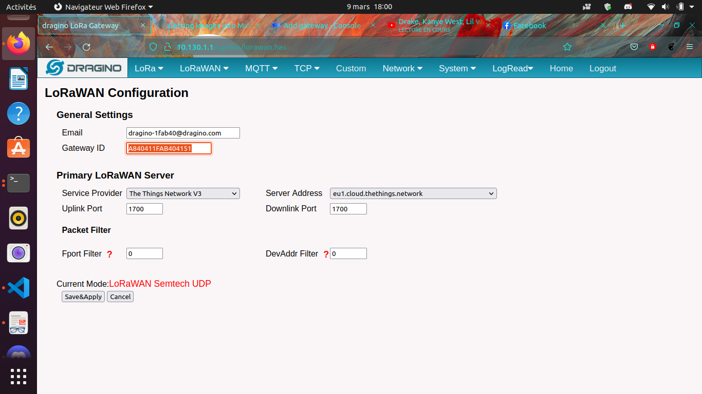
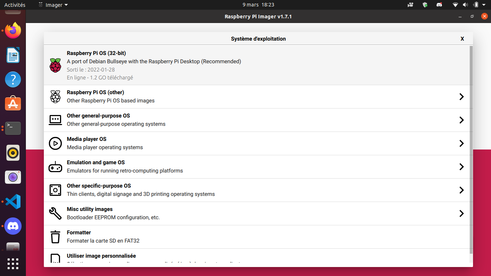
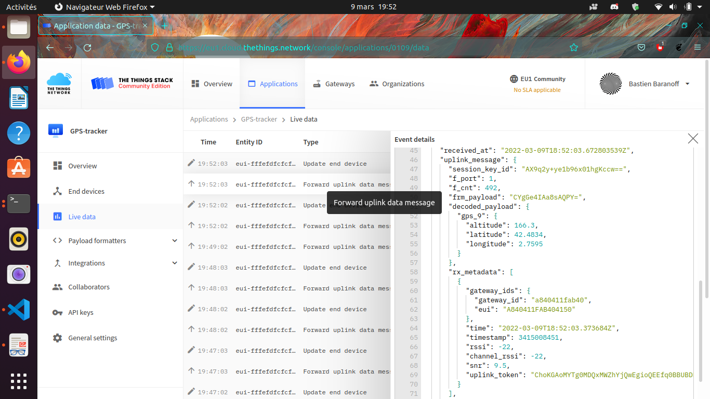
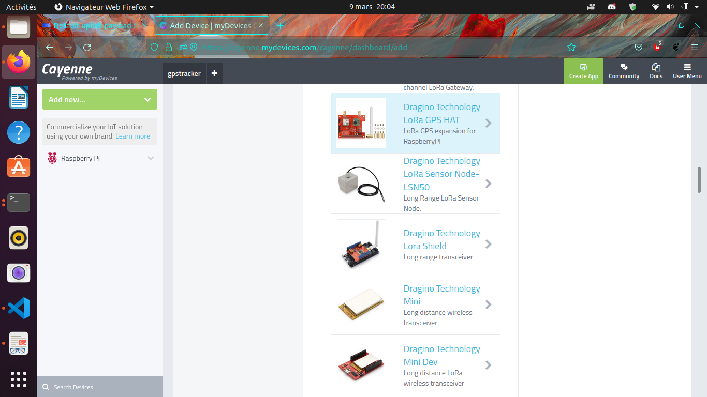

----
Lora
----

GPS tracker via LoraWAN
-----------------------

.. image:: uml.png
   :target: uml.png
   :alt: UML

ISO : https://drive.google.com/file/d/1YTdmb8JlvePSKiniwBKYyqXx-m-NhzIe/view?usp=sharing

**Installation du routeur sur Internet (via WiFi)**

N.B. : Pourquoi via WiFi ? Dans le cas particulier de l'Université de Perpignan Via Domitia, le FireWall "n'aime" pas les connections sur le port 1700 nécessaire à l'établissement de la connection routeur -> TheThingsNetwork.

* Plug on sector the gateway with USB-C 5V-2A
  a WiFi network dragino-XXXXXX apparait. 
* Connect to it via the password "dragino+dragino"
* Go on the webbrowser on IP 10.130.1.1 an Id/Pwd is asked by the dragino (by default) "root" / "dragino"
* Connect via the WiFi Mesh the dragino as a client to your smartphone or your box for example

.. image:: WiFi_Dragino.png
   :target: WiFi_Dragino.png
   :alt: WiFi_Dragino

**Routage des paquets LoRa vers TheThingsNetwork**

* Create a thethingsnetwork account (free, need email)
* We can see the Gateway EUI on the LoRa tab of the network interface
* We have to choose now TheThingsNetwork v3 on the defilant menu beside (the thingsnetwork v is avaible but not deserved for new gateways on TTN)
* On the second defilant menu choose eu1.cloud.thethings.network

On thethingsnetwork :

Fill the Gateway EUI same as precedent configuration on the dragino. Le GatewayID is free but must be unique and available on TTN. The gateway name is totally free of choice.
Enfin les Gateway Server Address doit correspondre au précedent soit pour l'Europe :
eu1.cloud.thethings.network

The last option can be let as it is.

You have now your gateway connected to LoRaWAN

.. image:: config_ttn_gw.png
   :target: config_ttn_gw.png
   :alt: config_ttn_gw

**Preparation of the RaspberryPi (the connected object) :**
A raspberry is a minicomputer of the height approximatively of a Bank card with the power of a smartphone et a I/O electrical pinout. The Operationnal System of this hardware is often (and in this study) on a micro-SD card (it can be Netboot, USB/HDD, eMMC). We gonna greate the SD card with this methodology :

**The SD-Card :**

Download Raspi-Imager from
https://www.raspberrypi.com/software/

To install it on Ubuntu > 20.04 you just have to do (Ctrl-Alt-t) and type

.. code-block:: bash

   sudo snap install rpi-imager

Then we download the Debian Bullseye OS

we select the following options
ssh : username/password (advice : "pi"/"raspberry")
Wifi : from the phone or any you have available
optional : set hostname = raspberry.local

.. image:: options_sd_rpi.png
   :target: options_sd_rpi.png
   :alt: options_sd_rpi

We the the media that will be written on
Then we put the SD-Card on the raspberry and monitor it via HDMI. Or if you don't have HDMI hardware you can access through SSH. For example if the local network is 192.168.1.0/24 you can do (on the host)

.. code-block:: bash

   nmap 192.168.1.1-254 -p 22

to know RPi IP adress or you can try

.. code-block:: bash

   sudo arp -a

Then to spawn a shell on the RPi

.. code-block:: bash

   ssh pi@ip_found_previously

or

.. code-block:: bash

   ssh pi@raspberrypi.local

Then on the shell

.. code-block:: bash

   sudo apt update && sudo apt upgrade

Now we install necessary packages

.. code-block:: bash

   sudo apt install git device-tree-compiler git python3-crypto python3-nmea2 python3-rpi.gpio python3-serial python3-spidev python3-configobj gpsd libgps-dev gpsd-clients python3-pip
   pip3 install simplecayennelpp
   git clone https://github.com/bbaranoff/libgps
   cd libgps
   make 
   sudo make install
   sudo ldconfig
   nano /etc/default/gpsd

.. code-block::

   # Default settings for the gpsd init script and the hotplug wrapper.

   # Start the gpsd daemon automatically at boot time
   START_DAEMON="true"

   # Use USB hotplugging to add new USB devices automatically to the daemon
   USBAUTO="false"

   # Devices gpsd should collect to at boot time.
   # They need to be read/writeable, either by user gpsd or the group dialout.
   DEVICES="/dev/ttyAMA0"

   # Other options you want to pass to gpsd
   GPSD_OPTIONS="-n"

Now we add to /boot/config.txt those lines at the end

.. code-block::

   enable_uart=1
   dtoverlay=miniuart-bt
   dtoverlay=spi-gpio-cs

We modify /boot/cmdline.txt to make it looks like

.. code-block::

   dwc_otg.lpm_enable=0 console=tty1 root=/dev/mmcblk0p2 rootfstype=ext4 elevator=deadline fsck.repair=yes rootwait

Then /home/pi

.. code-block:: bash

   git clone https://github.com/computenodes/dragino
   cd dragino/overlay
   dtc -@ -I dts -O dtb -o spi-gpio-cs.dtbo spi-gpio-cs-overlay.dts
   sudo cp spi-gpio-cs.dtbo /boot/overlays/
   sudo reboot

Then in /home/pi we create gpscron like :

.. code-block:: bash

   #!/bin/bash
   sudo python3 /home/pi/dragino/test_cayenne.py

It will be called par cron. (Advice ! Set ``sudo chmod 644 gpscorn`` to avoid privilege escalation)

Then we write in /home/pi/dragino : test_cayenne.py like

.. code-block:: python

   #!/usr/bin/env python3
   """
       Test harness for dragino module - sends hello world out over LoRaWAN 5 times
   """
   import logging
   from datetime import datetime
   from time import sleep
   import RPi.GPIO as GPIO
   from dragino import Dragino
   #import subprocess
   import gpsd
   from simplecayennelpp import CayenneLPP # import the module required to pack th$
   import binascii
   # importing the module
   # Connect to the local gpsd
   gpsd.connect()
   packet = gpsd.get_current()
   # See the inline docs for GpsResponse for the available data
   print(packet.position())
   lat = packet.lat
   lon = packet.lon
   alt = packet.alt

   print (lat, lon, alt)
   lpp = CayenneLPP()
   lpp.addGPS( 1, lat, lon, alt)
   text=binascii.hexlify(lpp.getBuffer()).decode()
   sent=list(binascii.unhexlify(text))
   print(text)
   logLevel=logging.DEBUG
   logging.basicConfig(filename="test.log", format='%(asctime)s - %(funcName)s - %(lineno)d - %(levelname)s - %(message)s', level=logLevel)
   D = Dragino("/home/pi/dragino/dragino.ini", logging_level=logLevel)
   D.join()
   while not D.registered():
       print("Waiting for JOIN ACCEPT")
       sleep(2)
   for i in range(0, 2):
       D.send_bytes(sent)
       start = datetime.utcnow()
       while D.transmitting:
           pass
       end = datetime.utcnow()
       print("Sent GPS coordinates ({})".format(end-start))
       sleep(1)

We take now /home/pi/dragino/dragino.ini.default to rewrite it to /home/pi/dragino/dragino.ini like

.. code-block::

   gps_baud_rate = 9600
   gps_serial_port = /dev/ttyS0
   gps_serial_timeout = 1
   gps_wait_period = 10

   #LoRaWAN configuration
   spreading_factor = 7
   max_power = 0x0F
   output_power = 0x0E
   sync_word = 0x34
   rx_crc = True
   #Where to store the frame count
   fcount_filename = .lora_fcount

   ##Valid auth modes are ABP or OTAA
   ##All values are hex arrays eg devaddr = 0x01, 0x02, 0x03, 0x04
   #auth_mode = "abp"
   #devaddr = 
   #nwskey = 
   #appskey =

   auth_mode = otaa
   deveui = 0xFF, 0xFE, 0xFD, 0xFC, 0xFC, 0xFD, 0xFE, 0xFF
   appeui = 0x70, 0xB3, 0xD5, 0x00, 0x00, 0xD5, 0xB3, 0x70
   appkey = 0x3D, 0x83, 0xC3, 0x16, 0x2C, 0xAD, 0x44, 0xB7, 0xB0, 0x50, 0x6C, 0x3C, 0xA1, 0x54, 0x36, 0xB7

By choosing DevEUI, AppEUI (unique on TTN), and AppKey with enough entropy that it can't be cracked (beware of MSB, LSB writing between dragin_cayenne.py and TTN)
Enfin pour executer le script python toutes les minutes :

.. code-block:: bash

   sudo crontab -e

We select our favorite editor to add

.. code-block::

   * * * * * /home/pi/gpscron

at the endfile.
For the raspberry we are now ready to go. Lets see from the network side

**LoraWan Conection (TheThingsNetwork)**

Go to application -> Create then in EndDevices -> + Add Endevice

.. image:: add_enddevice.png
   :target: add_enddevice.png
   :alt: add_enddevice

Then with previous parameters set on the RPi (AppEUI, DevEUI, AppKey)  in /home/pi/dragino/dragino.ini we put them on TTN

So in this study example :

.. code-block::

   deveui = 0xFF, 0xFE, 0xFD, 0xFC, 0xFC, 0xFD, 0xFE, 0xFF
   appeui = 0x70, 0xB3, 0xD5, 0x00, 0x00, 0xD5, 0xB3, 0x70
   appkey = 0x3D, 0x83, 0xC3, 0x16, 0x2C, 0xAD, 0x44, 0xB7, 0xB0, 0x50, 0x6C, 0x3C, 0xA1, 0x54, 0x36, 0xB7

.. image:: register_enddevice.png
   :target: register_enddevice.png
   :alt: register_enddevice

Power On the Pi (Trick to make GPS work (on RPi) !!!!!)

Sur le shell du pi :

.. code-block:: bash

   sudo ntpdate fr.pool.ntp.org

Put the RPi outside
Pull off the Tx Jumper of the dragino and wait for 3D Fix (the green blinking light of the dragino). Then hotplug the jumper Tx.

You should have (your first ?) connected object

**Payload Format**

In this study we have choose the CayenneLPP format like 

.. image:: format_cayenne.png
   :target: format_cayenne.png
   :alt: format_cayenne

In the created application you should see your device

**Data monitoring (Cayenne Integration)**

Go to https://mydevices.com/

Create a Cayenne Account

Select TheThingsNetwork

.. image:: add_new_cayenne.png
   :target: add_new_cayenne.png
   :alt: add_new_cayenne

Sélection Dragino RPi Hat et mettre le DevEUI

.. image:: gps_live.png
   :target: gps_live.png
   :alt: gps_live

Live Data from GPS tracker !

\newpage

